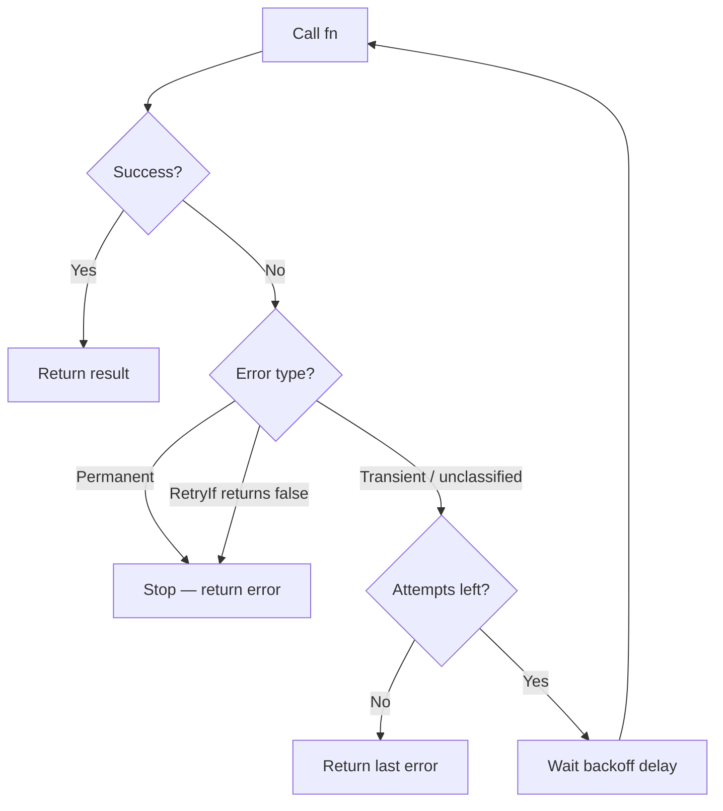

*[Read in English](README.md)*

# Exemple 02 — Retry

Demonstration complete du patron de retry avec les quatre strategies de backoff
et les controles avances de retry.

## Ce que cet exemple demontre

### Strategies de backoff

- **Backoff constant** (`ConstantBackoff`) — delai fixe entre chaque tentative
  de retry, utile pour le polling ou les retentatives a intervalle fixe.
- **Backoff exponentiel** (`ExponentialBackoff`) — le delai double a chaque
  tentative (`base * 2^attempt`), l'approche standard de retry pour les
  systemes distribues.
- **Backoff lineaire** (`LinearBackoff`) — le delai augmente lineairement
  (`step * (attempt+1)`), un compromis entre constant et exponentiel.
- **Backoff exponentiel avec jitter** (`ExponentialJitterBackoff`) — delai
  aleatoire dans `[0, base * 2^attempt]`, previent les problemes de
  thundering-herd lorsque de nombreux clients retentent simultanement.

### Controles avances

- **`MaxDelay`** — plafonne le delai de backoff afin que la croissance
  exponentielle ne produise pas des temps d'attente deraisonnablement longs.
- **`PerAttemptTimeout`** — definit un delai d'expiration par tentative,
  independant du timeout global de la politique. Les tentatives lentes sont
  annulees et retentees.
- **`RetryIf`** — une fonction predicat qui decide si une erreur donnee doit
  entrainer une retentative. Retourner `false` arrete immediatement les
  retentatives pour cette erreur.
- **Erreurs permanentes** (`r8e.Permanent(err)`) — encapsuler une erreur comme
  permanente arrete toutes les retentatives, quel que soit le budget de retry.

## Flux de retry



## Concepts cles

| Concept | Detail |
|---|---|
| `Transient(err)` | Marque une erreur comme retentable (c'est le comportement par defaut pour les erreurs non classifiees) |
| `Permanent(err)` | Marque une erreur comme non retentable — arrete immediatement les retentatives |
| `MaxDelay(d)` | Plafonne le delai de backoff calcule |
| `PerAttemptTimeout(d)` | Delai d'expiration par tentative individuelle |
| `RetryIf(fn)` | Predicat personnalise controlant quelles erreurs declenchent une retentative |

## Execution

```bash
go run ./examples/02-retry/
```

## Sortie attendue

Six sections montrant chaque strategie de backoff et chaque controle en action,
avec les journaux de tentatives et les resultats finaux.
