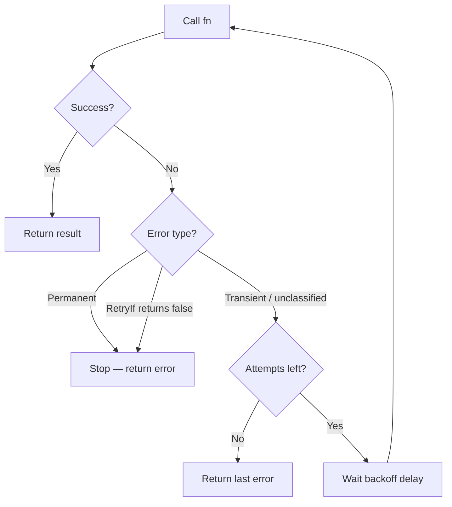

*[Read in English](README.md)*

# Exemple 02 — Retry

Démonstration complète du patron de retry avec les quatre stratégies de backoff
et les contrôles avancés de retry.

## Ce que cet exemple démontre

### Stratégies de backoff

- **Backoff constant** (`ConstantBackoff`) — délai fixe entre chaque tentative
  de retry, utile pour le polling ou les retentatives à intervalle régulier.
- **Backoff exponentiel** (`ExponentialBackoff`) — le délai double à chaque
  tentative (`base * 2^attempt`), c'est l'approche de retry standard pour les
  systèmes distribués.
- **Backoff linéaire** (`LinearBackoff`) — le délai augmente linéairement
  (`step * (attempt+1)`), un compromis entre le constant et l'exponentiel.
- **Backoff exponentiel avec jitter** (`ExponentialJitterBackoff`) — délai
  aléatoire dans `[0, base * 2^attempt]`, qui prévient les problèmes de
  thundering-herd lorsque de nombreux clients retentent en même temps.

### Contrôles avancés

- **`MaxDelay`** — plafonne le délai de backoff afin que la croissance
  exponentielle ne produise pas des temps d'attente déraisonnablement longs.
- **`PerAttemptTimeout`** — définit un délai d'expiration par tentative,
  indépendant du timeout global de la politique. Les tentatives lentes sont
  annulées puis retentées.
- **`RetryIf`** — une fonction prédicat qui décide si une erreur donnée doit
  entraîner une retentative. Renvoyer `false` arrête immédiatement les
  retentatives pour cette erreur.
- **Erreurs permanentes** (`r8e.Permanent(err)`) — encapsuler une erreur comme
  permanente arrête toutes les retentatives, quel que soit le budget de retry.

## Flux de retry


```mermaid
flowchart TD
    A[Call fn] --> B{Success?}
    B -->|Yes| C[Return result]
    B -->|No| D{Error type?}
    D -->|Permanent| E[Stop — return error]
    D -->|RetryIf returns false| E
    D -->|Transient / unclassified| F{Attempts left?}
    F -->|No| G[Return last error]
    F -->|Yes| H[Wait backoff delay]
    H --> A
```

## Concepts clés

| Concept | Détail |
|---|---|
| `Transient(err)` | Marque une erreur comme retentable (c'est le comportement par défaut pour les erreurs non classifiées) |
| `Permanent(err)` | Marque une erreur comme non retentable — arrête immédiatement les retentatives |
| `MaxDelay(d)` | Plafonne le délai de backoff calculé |
| `PerAttemptTimeout(d)` | Délai d'expiration par tentative individuelle |
| `RetryIf(fn)` | Prédicat personnalisé contrôlant quelles erreurs déclenchent une retentative |

## Exécution

```bash
go run ./examples/02-retry/
```

## Sortie attendue

Six sections montrant chaque stratégie de backoff et chaque contrôle en action,
avec les journaux de tentatives et les résultats finaux.
