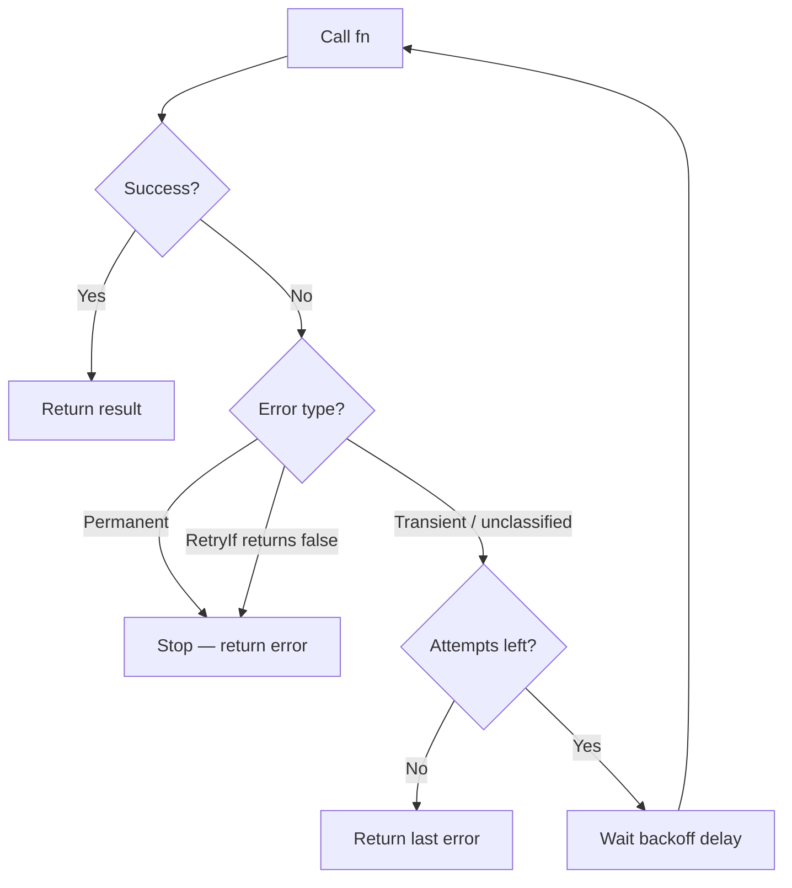

# Example 02 — Retry

Comprehensive demonstration of the retry pattern with all four backoff
strategies and advanced retry controls.

## What it demonstrates

### Backoff strategies

- **Constant backoff** (`ConstantBackoff`) — fixed delay between every retry
  attempt, useful for polling or fixed-interval retries.
- **Exponential backoff** (`ExponentialBackoff`) — delay doubles on each
  attempt (`base * 2^attempt`), the standard retry approach for distributed
  systems.
- **Linear backoff** (`LinearBackoff`) — delay increases linearly
  (`step * (attempt+1)`), a middle ground between constant and exponential.
- **Exponential jitter backoff** (`ExponentialJitterBackoff`) — random delay
  in `[0, base * 2^attempt]`, prevents thundering-herd problems when many
  clients retry simultaneously.

### Advanced controls

- **`MaxDelay`** — caps the backoff delay so exponential growth doesn't
  produce unreasonably long waits.
- **`PerAttemptTimeout`** — sets a per-attempt deadline independent of the
  global policy timeout. Slow attempts are cancelled and retried.
- **`RetryIf`** — a predicate function that decides whether a given error
  should be retried. Returning `false` stops retries immediately for that
  error.
- **Permanent errors** (`r8e.Permanent(err)`) — wrapping an error as
  permanent stops all retries regardless of the retry budget.

## Retry flow



## Key concepts

| Concept | Detail |
|---|---|
| `Transient(err)` | Marks an error as retriable (this is the default for unclassified errors) |
| `Permanent(err)` | Marks an error as non-retriable — stops retries immediately |
| `MaxDelay(d)` | Caps the computed backoff delay |
| `PerAttemptTimeout(d)` | Deadline per individual attempt |
| `RetryIf(fn)` | Custom predicate controlling which errors trigger a retry |

## Run

```bash
go run ./examples/02-retry/
```

## Expected output

Six sections showing each backoff strategy and control in action, with attempt
logs and final results.
