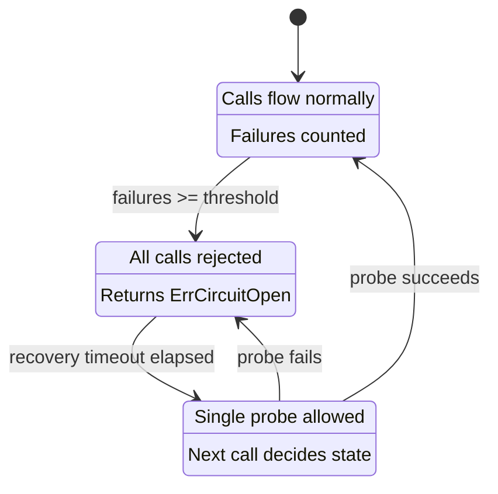

*[Read in English](README.md)*

# Exemple 03 — Circuit Breaker

Demontre la machine a etats du circuit breaker : **closed** (normal),
**open** (echec immediat) et **half-open** (sonde de reprise).

## Ce que cet exemple demontre

L'exemple parcourt le cycle de vie complet d'un circuit breaker :

1. **Phase 1 — Declenchement d'echecs :** Trois echecs consecutifs atteignent
   le seuil `FailureThreshold(3)`, provoquant la transition du breaker de
   closed a **open**. Un quatrieme appel est immediatement rejete avec
   `ErrCircuitOpen` sans atteindre le service en aval.

2. **Phase 2 — Delai de reprise :** Le programme attend au-dela du
   `RecoveryTimeout(500ms)`, permettant au breaker de passer a **half-open**.

3. **Phase 3 — Sonde half-open :** L'appel suivant est autorise a passer en
   tant que sonde. Puisque le service en aval a recupere
   (`shouldFail = false`), la sonde reussit et le breaker revient a **closed**.

4. **Phase 4 — Fonctionnement normal :** Les appels suivants transitent
   normalement a travers le breaker ferme.

Les hooks de cycle de vie (`OnCircuitOpen`, `OnCircuitHalfOpen`,
`OnCircuitClose`) journalisent chaque transition d'etat au moment ou elle se
produit.

## Machine a etats



## Concepts cles

| Concept | Detail |
|---|---|
| `FailureThreshold(n)` | Nombre d'echecs consecutifs avant l'ouverture du breaker |
| `RecoveryTimeout(d)` | Duree pendant laquelle le breaker reste ouvert avant de passer en half-open |
| `HalfOpenMaxAttempts(n)` | Nombre de sondes reussies necessaires pour refermer le breaker |
| `ErrCircuitOpen` | Erreur sentinelle retournee lorsqu'un appel est rejete par un breaker ouvert |

## Execution

```bash
go run ./examples/03-circuit-breaker/
```

## Sortie attendue

Les transitions d'etat sont journalisees via les hooks, montrant le breaker
s'ouvrir apres les echecs, puis recuperer en passant par half-open pour revenir
a closed.
