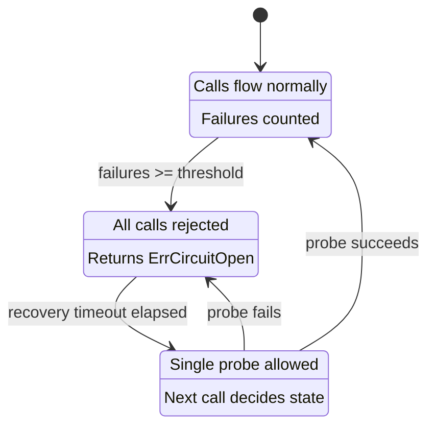

*[Read in English](README.md)*

# Exemple 03 — Circuit Breaker

Démontre la machine à états du circuit breaker : **closed** (normal),
**open** (échec immédiat) et **half-open** (sonde de reprise).

## Ce que cet exemple démontre

L'exemple parcourt le cycle de vie complet d'un circuit breaker :

1. **Phase 1 — Déclenchement d'échecs :** Trois échecs consécutifs atteignent
   le seuil `FailureThreshold(3)`, ce qui provoque la transition du breaker de
   closed à **open**. Un quatrième appel est immédiatement rejeté avec
   `ErrCircuitOpen` sans jamais atteindre le service en aval.

2. **Phase 2 — Délai de reprise :** Le programme attend au-delà du
   `RecoveryTimeout(500ms)`, ce qui permet au breaker de passer à **half-open**.

3. **Phase 3 — Sonde half-open :** L'appel suivant est autorisé à passer en
   tant que sonde. Comme le service en aval s'est rétabli
   (`shouldFail = false`), la sonde réussit et le breaker revient à **closed**.

4. **Phase 4 — Fonctionnement normal :** Les appels suivants transitent
   normalement à travers le breaker fermé.

Les hooks de cycle de vie (`OnCircuitOpen`, `OnCircuitHalfOpen`,
`OnCircuitClose`) journalisent chaque transition d'état au moment où elle se
produit.

## Machine à états


```mermaid
stateDiagram-v2
    [*] --> Closed
    Closed --> Open : failures >= threshold
    Open --> HalfOpen : recovery timeout elapsed
    HalfOpen --> Closed : probe succeeds
    HalfOpen --> Open : probe fails

    Closed : Calls flow normally
    Closed : Failures counted
    Open : All calls rejected
    Open : Returns ErrCircuitOpen
    HalfOpen : Single probe allowed
    HalfOpen : Next call decides state
```

## Concepts clés

| Concept | Détail |
|---|---|
| `FailureThreshold(n)` | Nombre d'échecs consécutifs avant l'ouverture du breaker |
| `RecoveryTimeout(d)` | Durée pendant laquelle le breaker reste ouvert avant de passer en half-open |
| `HalfOpenMaxAttempts(n)` | Nombre de sondes réussies nécessaires pour refermer le breaker |
| `ErrCircuitOpen` | Erreur sentinelle renvoyée lorsqu'un appel est rejeté par un breaker ouvert |

## Exécution

```bash
go run ./examples/03-circuit-breaker/
```

## Sortie attendue

Les transitions d'état sont journalisées via les hooks, montrant le breaker
s'ouvrir après les échecs, puis se rétablir en passant par half-open pour
revenir à closed.
