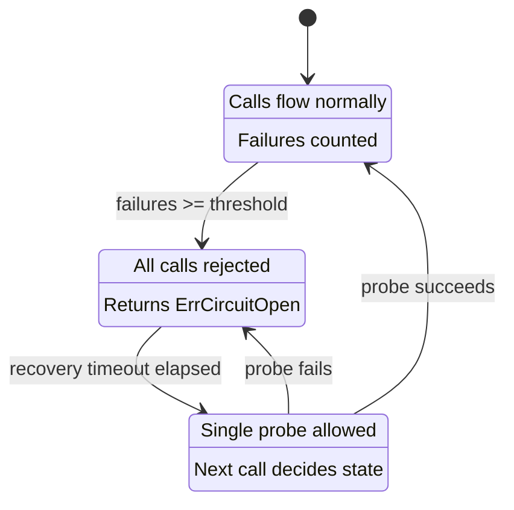

*[Lire en Francais](README.fr.md)*

# Example 03 — Circuit Breaker

Demonstrates the circuit breaker state machine: **closed** (normal),
**open** (fast-fail), and **half-open** (probe recovery).

## What it demonstrates

The example walks through the full lifecycle of a circuit breaker:

1. **Phase 1 — Trigger failures:** Three consecutive failures hit the
   `FailureThreshold(3)`, causing the breaker to transition from closed to
   **open**. A fourth call is immediately rejected with `ErrCircuitOpen`
   without reaching the downstream.

2. **Phase 2 — Recovery timeout:** The program sleeps past the
   `RecoveryTimeout(500ms)`, allowing the breaker to transition to
   **half-open**.

3. **Phase 3 — Half-open probe:** The next call is allowed through as a
   probe. Since the downstream has recovered (`shouldFail = false`), the
   probe succeeds and the breaker transitions back to **closed**.

4. **Phase 4 — Normal operation:** Subsequent calls flow normally through the
   closed breaker.

Lifecycle hooks (`OnCircuitOpen`, `OnCircuitHalfOpen`, `OnCircuitClose`) log
each state transition as it happens.

## State machine



## Key concepts

| Concept | Detail |
|---|---|
| `FailureThreshold(n)` | Number of consecutive failures before the breaker opens |
| `RecoveryTimeout(d)` | How long the breaker stays open before entering half-open |
| `HalfOpenMaxAttempts(n)` | Number of successful probes required to close the breaker |
| `ErrCircuitOpen` | Sentinel error returned when a call is rejected by an open breaker |

## Run

```bash
go run ./examples/03-circuit-breaker/
```

## Expected output

State transitions are logged via hooks, showing the breaker open after
failures, then recover through half-open back to closed.
