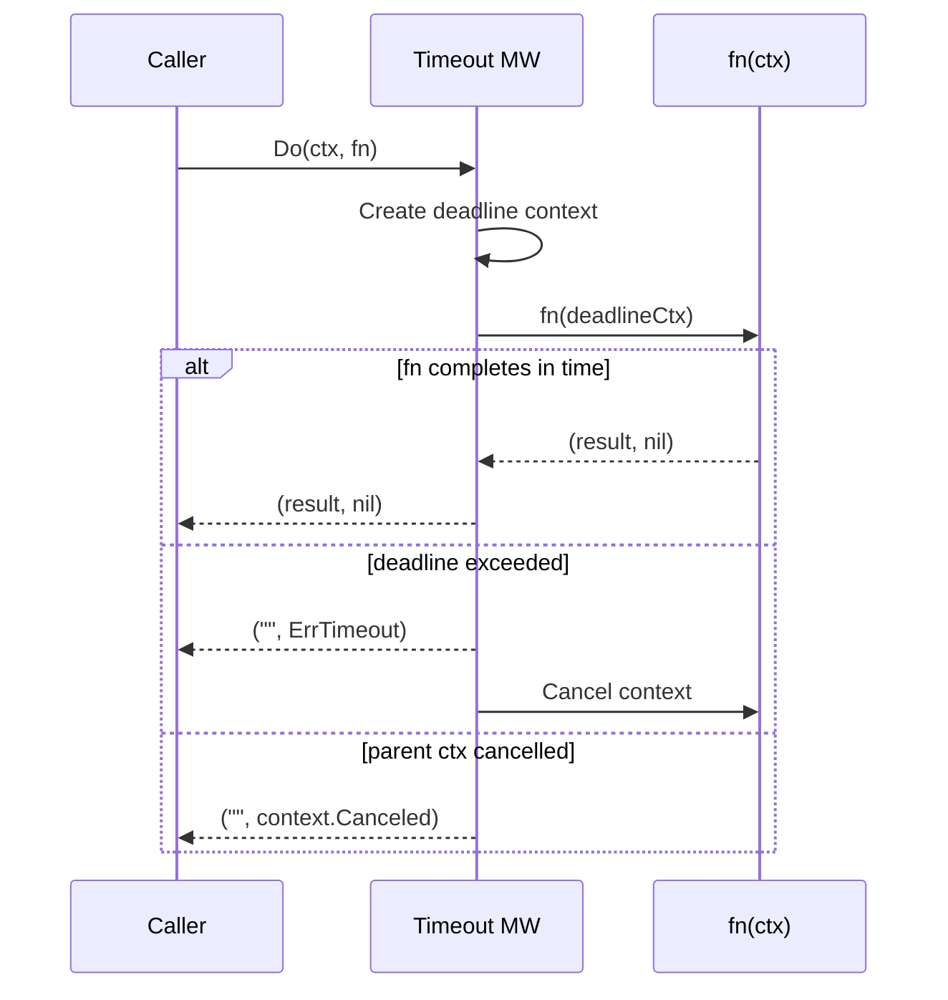

*[Read in English](README.md)*

# Exemple 04 — Timeout

Demontre le patron de timeout global et son interaction avec l'annulation de
contexte.

## Ce que cet exemple demontre

Trois scenarios illustrent le comportement du timeout :

1. **Appel rapide** — La fonction retourne avant l'echeance de 200ms. Le
   resultat est retourne normalement ; aucun timeout ne se declenche.

2. **Appel lent** — La fonction prend 1 seconde, depassant le timeout de
   200ms. Le contexte passe a `fn` est annule et `r8e.ErrTimeout` est
   retourne. La fonction devrait verifier `ctx.Done()` pour se terminer
   rapidement.

3. **Annulation du contexte parent** — Un contexte parent est annule de
   l'exterieur apres 50ms (avant le timeout de 200ms). L'erreur retournee est
   `context.Canceled` du parent, et *non* `ErrTimeout`. Cette distinction
   permet aux appelants de differencier les timeouts imposes par r8e des
   annulations externes.

## Fonctionnement



## Concepts cles

| Concept | Detail |
|---|---|
| `WithTimeout(d)` | Definit une echeance pour l'ensemble de l'appel ; en cas de depassement, retourne `ErrTimeout` |
| `ErrTimeout` | Erreur sentinelle distinguant les timeouts imposes par r8e des autres erreurs de contexte |
| Propagation du contexte | Le contexte derive est passe a `fn`, qui doit respecter `ctx.Done()` |
| Parent vs timeout | Si le contexte parent est annule en premier, l'erreur du parent est retournee a la place de `ErrTimeout` |

## Execution

```bash
go run ./examples/04-timeout/
```

## Sortie attendue

```
=== Appel rapide (se termine dans le delai imparti) ===
  result: "fast response", err: <nil>

=== Appel lent (depasse le timeout de 200ms) ===
  err: timeout (expiration comme attendu)

=== Annulation du contexte parent ===
  err: context canceled (annulation par le parent, pas un timeout)
```
