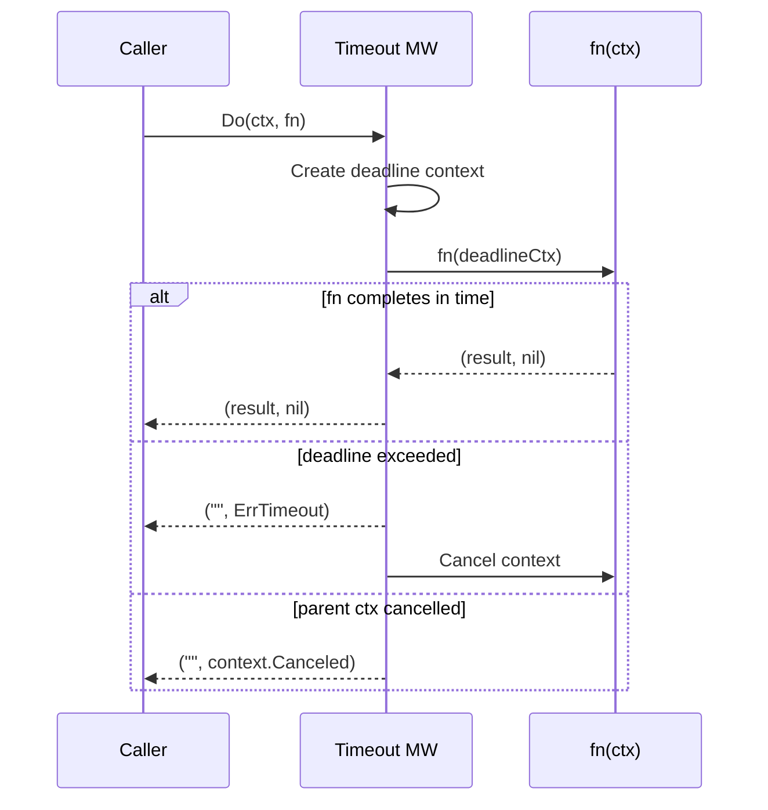

*[Read in English](README.md)*

# Exemple 04 — Timeout

Démontre le patron de timeout global et son interaction avec l'annulation de
contexte.

## Ce que cet exemple démontre

Trois scénarios illustrent le comportement du timeout :

1. **Appel rapide** — La fonction retourne avant l'échéance de 200ms. Le
   résultat est renvoyé normalement ; aucun timeout ne se déclenche.

2. **Appel lent** — La fonction prend 1 seconde, dépassant le timeout de
   200ms. Le contexte passé à `fn` est annulé et `r8e.ErrTimeout` est
   renvoyé. La fonction devrait surveiller `ctx.Done()` pour se terminer
   rapidement.

3. **Annulation du contexte parent** — Un contexte parent est annulé depuis
   l'extérieur après 50ms (avant le timeout de 200ms). L'erreur renvoyée est
   alors `context.Canceled` du parent, et *non* `ErrTimeout`. Cette distinction
   permet aux appelants de différencier les timeouts imposés par r8e des
   annulations externes.

## Fonctionnement


```mermaid
sequenceDiagram
    participant C as Caller
    participant T as Timeout MW
    participant F as fn(ctx)

    C->>T: Do(ctx, fn)
    T->>T: Create deadline context
    T->>F: fn(deadlineCtx)

    alt fn completes in time
        F-->>T: (result, nil)
        T-->>C: (result, nil)
    else deadline exceeded
        T-->>C: ("", ErrTimeout)
        T->>F: Cancel context
    else parent ctx cancelled
        T-->>C: ("", context.Canceled)
    end
```

## Concepts clés

| Concept | Détail |
|---|---|
| `WithTimeout(d)` | Définit une échéance pour l'ensemble de l'appel ; en cas de dépassement, renvoie `ErrTimeout` |
| `ErrTimeout` | Erreur sentinelle distinguant les timeouts imposés par r8e des autres erreurs de contexte |
| Propagation du contexte | Le contexte dérivé est passé à `fn`, qui doit respecter `ctx.Done()` |
| Parent vs timeout | Si le contexte parent est annulé en premier, c'est l'erreur du parent qui est renvoyée à la place d'`ErrTimeout` |

## Exécution

```bash
go run ./examples/04-timeout/
```

## Sortie attendue

```
=== Appel rapide (se termine dans le délai imparti) ===
  result: "fast response", err: <nil>

=== Appel lent (dépasse le timeout de 200ms) ===
  err: timeout (expiration comme attendu)

=== Annulation du contexte parent ===
  err: context canceled (annulation par le parent, pas un timeout)
```
