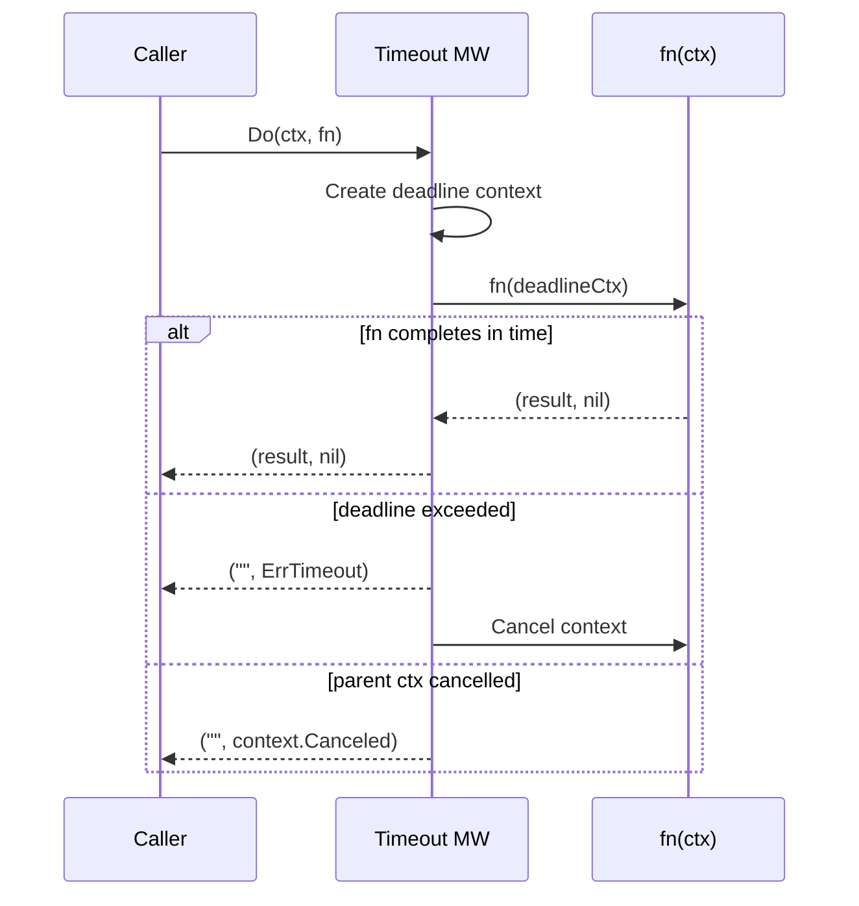

*[Lire en Francais](README.fr.md)*

# Example 04 — Timeout

Demonstrates the global timeout pattern and how it interacts with context
cancellation.

## What it demonstrates

Three scenarios illustrate timeout behavior:

1. **Fast call** — The function returns before the 200ms deadline. The result
   is returned normally; no timeout fires.

2. **Slow call** — The function takes 1 second, exceeding the 200ms timeout.
   The context passed to `fn` is cancelled, and `r8e.ErrTimeout` is returned.
   The function should check `ctx.Done()` to exit promptly.

3. **Parent context cancellation** — A parent context is cancelled externally
   after 50ms (before the 200ms timeout). The error returned is the parent's
   `context.Canceled`, *not* `ErrTimeout`. This distinction lets callers
   differentiate between r8e timeouts and external cancellations.

## How it works



## Key concepts

| Concept | Detail |
|---|---|
| `WithTimeout(d)` | Sets a deadline for the entire call; if exceeded, returns `ErrTimeout` |
| `ErrTimeout` | Sentinel error distinguishing r8e-imposed timeouts from other context errors |
| Context propagation | The derived context is passed to `fn`, which should respect `ctx.Done()` |
| Parent vs timeout | If the parent context is cancelled first, the parent's error is returned instead of `ErrTimeout` |

## Run

```bash
go run ./examples/04-timeout/
```

## Expected output

```
=== Fast call (completes within timeout) ===
  result: "fast response", err: <nil>

=== Slow call (exceeds 200ms timeout) ===
  err: timeout (timed out as expected)

=== Parent context cancelled ===
  err: context canceled (parent cancelled, not timeout)
```
