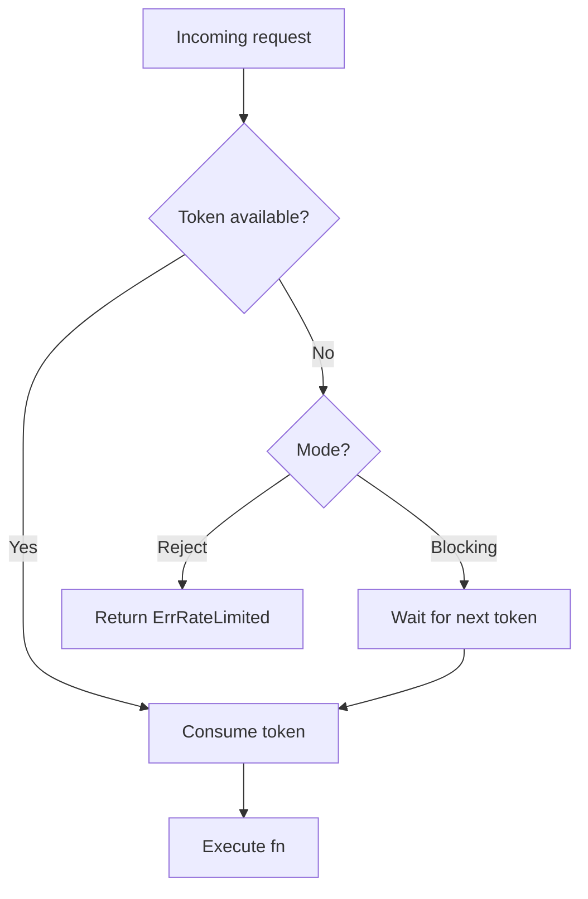

*[Read in English](README.md)*

# Exemple 05 — Rate Limiter

Illustre le limiteur de debit a seau de jetons (token bucket) en modes **rejet** et **bloquant**.

## Ce que cet exemple illustre

### Mode rejet (par defaut)

Un limiteur de debit configure a 5 jetons/seconde recoit 8 requetes en rafale.
Les ~5 premieres reussissent (en consommant les jetons disponibles dans le
burst), et les requetes restantes sont immediatement rejetees avec
`ErrRateLimited`. Aucune attente n'a lieu -- le trafic excedentaire est
elimine instantanement.

### Mode bloquant

Le meme debit (5 jetons/seconde) est configure avec `RateLimitBlocking()`.
Au lieu de rejeter les requetes excedentaires, le limiteur bloque jusqu'a ce
qu'un jeton devienne disponible. Les ~5 premieres requetes se terminent
instantanement ; les requetes restantes sont retardees jusqu'au
reapprovisionnement de nouveaux jetons (un toutes les 200 ms a 5/sec).

## Concepts cles

| Concept | Detail |
|---|---|
| `WithRateLimit(rate)` | Limiteur a seau de jetons autorisant `rate` requetes par seconde |
| `RateLimitBlocking()` | Option pour bloquer (attendre un jeton) au lieu de rejeter |
| `ErrRateLimited` | Erreur sentinelle renvoyee en mode rejet lorsqu'aucun jeton n'est disponible |
| Seau de jetons | Les jetons s'accumulent a `rate/sec` ; la capacite de burst est egale au debit |

## Fonctionnement



## Quand utiliser chaque mode

- **Mode rejet** -- Passerelles API, delestage de charge, ou lorsque les
  appelants peuvent reessayer plus tard. Fournit un retour immediat.
- **Mode bloquant** -- Workers d'arriere-plan, traitements par lots, ou
  pipelines internes ou l'on souhaite lisser le debit plutot que de rejeter
  des requetes.

## Execution

```bash
go run ./examples/05-rate-limiter/
```

## Sortie attendue

Le mode rejet montre certaines requetes qui reussissent et d'autres qui
recoivent `RATE LIMITED`. Le mode bloquant montre que toutes les requetes
finissent par reussir, les dernieres etant retardees par l'intervalle de
reapprovisionnement des jetons.
