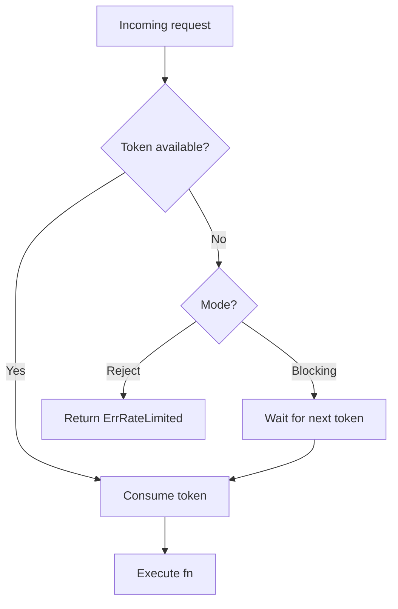

*[Read in English](README.md)*

# Exemple 05 — Rate Limiter

Illustre le limiteur de débit à seau de jetons (token bucket) en modes **rejet** et **bloquant**.

## Ce que cet exemple illustre

### Mode rejet (par défaut)

Un limiteur de débit configuré à 5 jetons/seconde reçoit 8 requêtes en rafale.
Les ~5 premières réussissent (en consommant les jetons disponibles dans le
burst), et les requêtes restantes sont immédiatement rejetées avec
`ErrRateLimited`. Aucune attente n'a lieu — le trafic excédentaire est
éliminé instantanément.

### Mode bloquant

Le même débit (5 jetons/seconde) est configuré avec `RateLimitBlocking()`.
Au lieu de rejeter les requêtes excédentaires, le limiteur bloque jusqu'à ce
qu'un jeton devienne disponible. Les ~5 premières requêtes se terminent
instantanément ; les requêtes restantes sont retardées jusqu'au
réapprovisionnement en nouveaux jetons (un toutes les 200 ms à 5/sec).

## Concepts clés

| Concept | Détail |
|---|---|
| `WithRateLimit(rate)` | Limiteur à seau de jetons autorisant `rate` requêtes par seconde |
| `RateLimitBlocking()` | Option pour bloquer (attendre un jeton) au lieu de rejeter |
| `ErrRateLimited` | Erreur sentinelle renvoyée en mode rejet lorsqu'aucun jeton n'est disponible |
| Seau de jetons | Les jetons s'accumulent à `rate/sec` ; la capacité de burst est égale au débit |

## Fonctionnement


```mermaid
flowchart TD
    A[Incoming request] --> B{Token available?}
    B -->|Yes| C[Consume token]
    C --> D[Execute fn]

    B -->|No| E{Mode?}
    E -->|Reject| F[Return ErrRateLimited]
    E -->|Blocking| G[Wait for next token]
    G --> C
```

## Quand utiliser chaque mode

- **Mode rejet** — Passerelles API, délestage de charge, ou lorsque les
  appelants peuvent réessayer plus tard. Il fournit un retour immédiat.
- **Mode bloquant** — Workers d'arrière-plan, traitements par lots, ou
  pipelines internes où l'on souhaite lisser le débit plutôt que de rejeter
  des requêtes.

## Exécution

```bash
go run ./examples/05-rate-limiter/
```

## Sortie attendue

Le mode rejet montre certaines requêtes qui réussissent et d'autres qui
reçoivent `RATE LIMITED`. Le mode bloquant montre que toutes les requêtes
finissent par réussir, les dernières étant retardées par l'intervalle de
réapprovisionnement des jetons.
