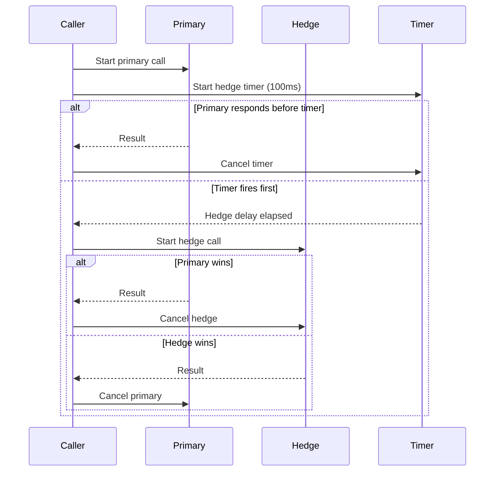

*[Read in English](README.md)*

# Exemple 07 — Requetes hedgees

Illustre les requetes hedgees (speculatives) qui reduisent la latence de queue
en lancant un second appel concurrent en concurrence avec le premier.

## Ce que cet exemple illustre

Une politique est configuree avec `WithHedge(100ms)`. Pour chaque appel :

1. L'appel **primaire** demarre immediatement.
2. Si le primaire n'a pas repondu dans les **100 ms**, un **hedge** (second
   appel concurrent) est lance avec la meme fonction.
3. **La premiere reponse arrivee l'emporte** -- le contexte de l'autre appel
   est annule.

L'exemple simule un service avec une latence aleatoire entre 50 ms et 300 ms.
Sur 5 appels, on peut observer :

- **Primaire rapide** (< 100 ms) -- le hedge ne se declenche pas ; le resultat
  du primaire est renvoye immediatement.
- **Primaire lent** (> 100 ms) -- le hedge se declenche (journalise par
  `OnHedgeTriggered`). Si le hedge se termine en premier, `OnHedgeWon` se
  declenche. Dans tous les cas, la reponse la plus rapide est renvoyee.

## Fonctionnement



## Concepts cles

| Concept | Detail |
|---|---|
| `WithHedge(delay)` | Lance un second appel si le primaire n'a pas repondu dans le delai `delay` |
| `OnHedgeTriggered` | Hook declenche lorsque le delai de hedge s'ecoule et qu'un second appel demarre |
| `OnHedgeWon` | Hook declenche lorsque l'appel hedge se termine avant le primaire |
| Annulation de contexte | Le contexte de l'appel perdant est annule pour liberer les ressources |

## Quand l'utiliser

- Services avec une latence de queue elevee (p99 >> p50) ou des appels
  occasionnellement lents dominent l'experience utilisateur.
- Operations en lecture seule ou idempotentes -- hedger des ecritures non
  idempotentes peut provoquer des effets de bord.
- Recherches DNS, lectures de cache ou appels API sans etat ou le cout d'une
  requete redondante est faible.

## Execution

```bash
go run ./examples/07-hedge/
```

## Sortie attendue

Cinq appels avec des latences variables. Certains declenchent le hedge ;
d'autres non. La sortie varie en raison de la latence aleatoire.
