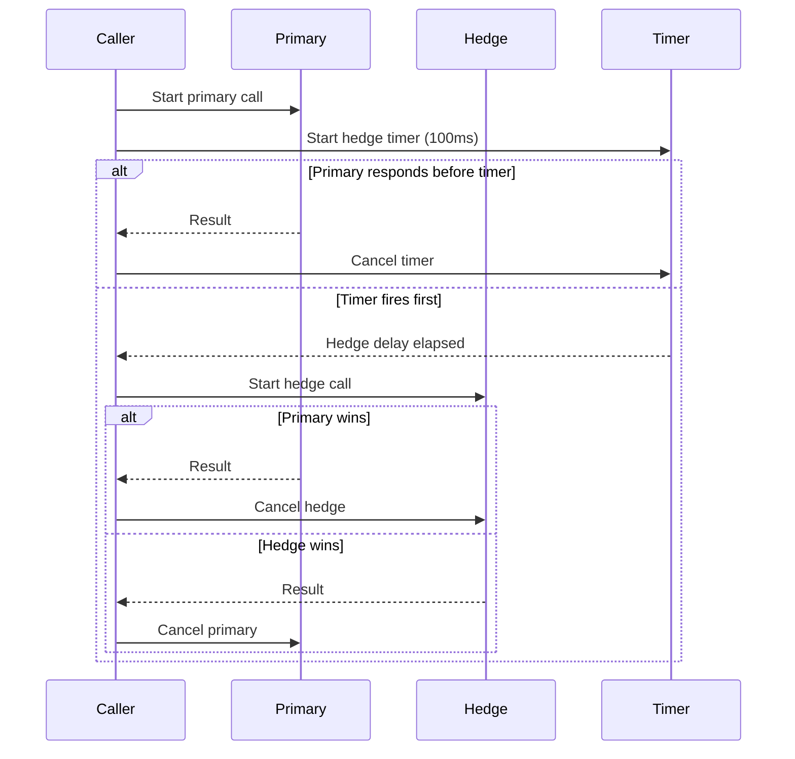

*[Read in English](README.md)*

# Exemple 07 — Requêtes hedgées

Illustre les requêtes hedgées (spéculatives) qui réduisent la latence de queue
en lançant un second appel concurrent en parallèle du premier.

## Ce que cet exemple illustre

Une politique est configurée avec `WithHedge(100ms)`. Pour chaque appel :

1. L'appel **primaire** démarre immédiatement.
2. Si le primaire n'a pas répondu dans les **100 ms**, un **hedge** (second
   appel concurrent) est lancé avec la même fonction.
3. **La première réponse arrivée l'emporte** — le contexte de l'autre appel
   est annulé.

L'exemple simule un service avec une latence aléatoire entre 50 ms et 300 ms.
Sur 5 appels, on peut observer :

- **Primaire rapide** (< 100 ms) — le hedge ne se déclenche pas ; le résultat
  du primaire est renvoyé immédiatement.
- **Primaire lent** (> 100 ms) — le hedge se déclenche (journalisé par
  `OnHedgeTriggered`). Si le hedge se termine en premier, `OnHedgeWon` se
  déclenche. Dans tous les cas, c'est la réponse la plus rapide qui est renvoyée.

## Fonctionnement


```mermaid
sequenceDiagram
    participant C as Caller
    participant P as Primary
    participant H as Hedge
    participant T as Timer

    C->>P: Start primary call
    C->>T: Start hedge timer (100ms)

    alt Primary responds before timer
        P-->>C: Result
        C->>T: Cancel timer
    else Timer fires first
        T-->>C: Hedge delay elapsed
        C->>H: Start hedge call
        alt Primary wins
            P-->>C: Result
            C->>H: Cancel hedge
        else Hedge wins
            H-->>C: Result
            C->>P: Cancel primary
        end
    end
```

## Concepts clés

| Concept | Détail |
|---|---|
| `WithHedge(delay)` | Lance un second appel si le primaire n'a pas répondu dans le délai `delay` |
| `OnHedgeTriggered` | Hook déclenché lorsque le délai de hedge s'écoule et qu'un second appel démarre |
| `OnHedgeWon` | Hook déclenché lorsque l'appel hedge se termine avant le primaire |
| Annulation de contexte | Le contexte de l'appel perdant est annulé pour libérer les ressources |

## Quand l'utiliser

- Services avec une latence de queue élevée (p99 >> p50) où des appels
  occasionnellement lents dominent l'expérience utilisateur.
- Opérations en lecture seule ou idempotentes — hedger des écritures non
  idempotentes peut provoquer des effets de bord.
- Recherches DNS, lectures de cache ou appels API sans état où le coût d'une
  requête redondante est faible.

## Exécution

```bash
go run ./examples/07-hedge/
```

## Sortie attendue

Cinq appels avec des latences variables. Certains déclenchent le hedge,
d'autres non. La sortie varie en raison de la latence aléatoire.
