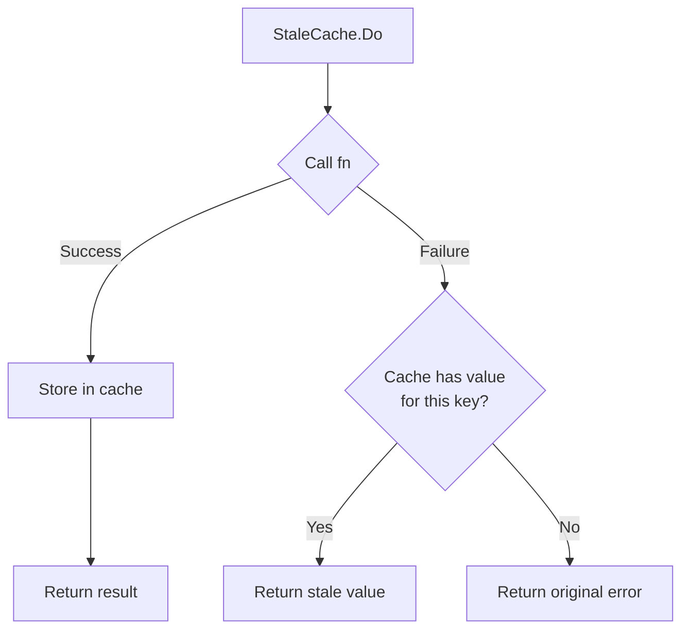

*[Read in English](README.md)*

# Exemple 08 — Stale Cache

Illustre le cache autonome a cle avec donnees obsoletes en cas d'erreur
(`StaleCache`). En cas de succes, les resultats sont mis en cache par cle. En
cas d'echec, la derniere valeur valide connue pour cette cle est servie si
elle est disponible.

## Ce que cet exemple illustre

Trois scenarios illustrent le comportement du stale cache :

1. **Succes -- cache alimente :** Le premier appel pour la cle `"user:1"`
   reussit. Le resultat est stocke dans le cache et le hook `OnCacheRefreshed`
   se declenche.

2. **Echec -- donnees obsoletes servies :** Le service aval est bascule en
   mode erreur. Le second appel pour la meme cle `"user:1"` echoue, mais le
   cache contient la valeur precedente. Le resultat obsolete est renvoye (sans
   erreur), et le hook `OnStaleServed` se declenche.

3. **Echec, cle differente -- pas de cache :** Un appel pour la cle `"user:2"`
   echoue. Comme aucune valeur en cache n'existe pour cette cle, l'erreur
   originale est propagee a l'appelant.

L'exemple utilise une simple `map` en memoire comme backend de cache pour
illustrer l'interface `Cache[K, V]` en action. En production, utilisez un
adaptateur de cache adapte comme `otter` ou `ristretto`.

## Flux de decision



## Concepts cles

| Concept | Detail |
|---|---|
| `StaleCache[K, V]` | Wrapper de cache autonome a cle -- ne fait pas partie de `Policy` |
| `Cache[K, V]` | Interface implementee par les backends de cache : `Get`, `Set`, `Delete` |
| `NewStaleCache` | Constructeur prenant un backend `Cache`, un TTL et des hooks optionnels |
| `OnStaleServed` | Hook declenche lorsqu'une valeur obsolete du cache est servie a la place d'une erreur |
| `OnCacheRefreshed` | Hook declenche lorsqu'une entree du cache est mise a jour apres un appel reussi |
| Isolation par cle | Chaque cle a sa propre valeur en cache ; une absence sur une cle n'affecte pas les autres |

## Composition avec Policy

`StaleCache` est autonome. Pour le combiner avec une `Policy`, appelez
`policy.Do` a l'interieur de `staleCache.Do` :

```go
result, err := sc.Do(ctx, key, func(ctx context.Context, k string) (string, error) {
    return policy.Do(ctx, func(ctx context.Context) (string, error) {
        return fetchData(ctx, k)
    })
})
```

## Execution

```bash
go run ./examples/08-stale-cache/
```

## Sortie attendue

```
=== Call 1: Success (populates cache) ===
  [hook] cache refreshed for key="user:1"
  result: "fresh data for user:1 at ...", err: <nil>

=== Call 2: Failure (served from stale cache) ===
  [hook] serving stale data for key="user:1"
  result: "fresh data for user:1 at ...", err: <nil>

=== Call 3: Different key, no cache ===
  err: downstream unavailable (no cached value for this key)
```
