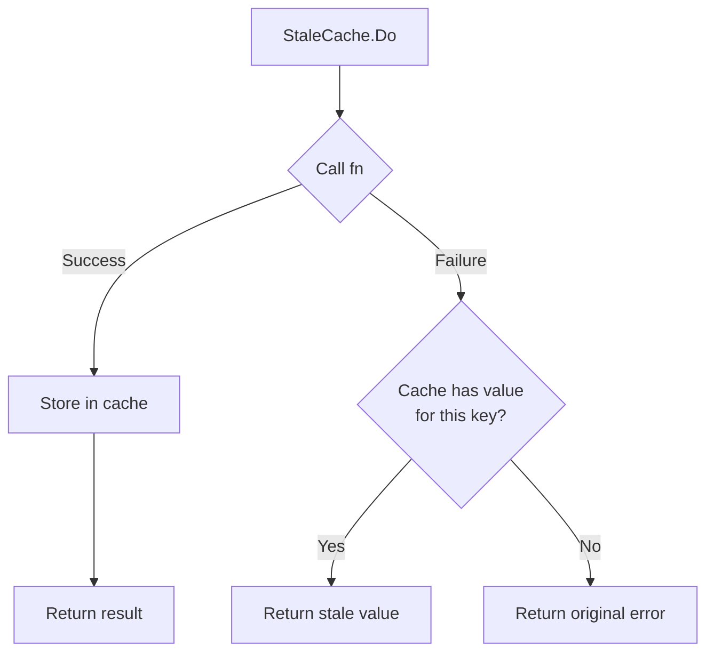

*[Read in English](README.md)*

# Exemple 08 — Stale Cache

Illustre le cache autonome à clé avec service de données obsolètes en cas
d'erreur (`StaleCache`). En cas de succès, les résultats sont mis en cache par
clé. En cas d'échec, la dernière valeur valide connue pour cette clé est servie
si elle est disponible.

## Ce que cet exemple illustre

Trois scénarios illustrent le comportement du stale cache :

1. **Succès — cache alimenté :** Le premier appel pour la clé `"user:1"`
   réussit. Le résultat est stocké dans le cache et le hook `OnCacheRefreshed`
   se déclenche.

2. **Échec — données obsolètes servies :** Le service aval est basculé en
   mode erreur. Le second appel pour la même clé `"user:1"` échoue, mais le
   cache contient la valeur précédente. Le résultat obsolète est renvoyé (sans
   erreur), et le hook `OnStaleServed` se déclenche.

3. **Échec, clé différente — pas de cache :** Un appel pour la clé `"user:2"`
   échoue. Comme aucune valeur en cache n'existe pour cette clé, l'erreur
   d'origine est propagée à l'appelant.

L'exemple utilise une simple `map` en mémoire comme backend de cache pour
illustrer l'interface `Cache[K, V]` en action. En production, utilisez un
adaptateur de cache adapté comme `otter` ou `ristretto`.

## Flux de décision


```mermaid
flowchart TD
    A[StaleCache.Do] --> B{Call fn}
    B -->|Success| C[Store in cache]
    C --> D[Return result]
    B -->|Failure| E{Cache has value<br/>for this key?}
    E -->|Yes| F[Return stale value]
    E -->|No| G[Return original error]
```

## Concepts clés

| Concept | Détail |
|---|---|
| `StaleCache[K, V]` | Wrapper de cache autonome à clé — ne fait pas partie de `Policy` |
| `Cache[K, V]` | Interface implémentée par les backends de cache : `Get`, `Set`, `Delete` |
| `NewStaleCache` | Constructeur prenant un backend `Cache`, un TTL et des hooks optionnels |
| `OnStaleServed` | Hook déclenché lorsqu'une valeur obsolète du cache est servie à la place d'une erreur |
| `OnCacheRefreshed` | Hook déclenché lorsqu'une entrée du cache est mise à jour après un appel réussi |
| Isolation par clé | Chaque clé a sa propre valeur en cache ; une absence sur une clé n'affecte pas les autres |

## Composition avec Policy

`StaleCache` est autonome. Pour le combiner avec une `Policy`, appelez
`policy.Do` à l'intérieur de `staleCache.Do` :

```go
result, err := sc.Do(ctx, key, func(ctx context.Context, k string) (string, error) {
    return policy.Do(ctx, func(ctx context.Context) (string, error) {
        return fetchData(ctx, k)
    })
})
```

## Exécution

```bash
go run ./examples/08-stale-cache/
```

## Sortie attendue

```
=== Call 1: Success (populates cache) ===
  [hook] cache refreshed for key="user:1"
  result: "fresh data for user:1 at ...", err: <nil>

=== Call 2: Failure (served from stale cache) ===
  [hook] serving stale data for key="user:1"
  result: "fresh data for user:1 at ...", err: <nil>

=== Call 3: Different key, no cache ===
  err: downstream unavailable (no cached value for this key)
```
