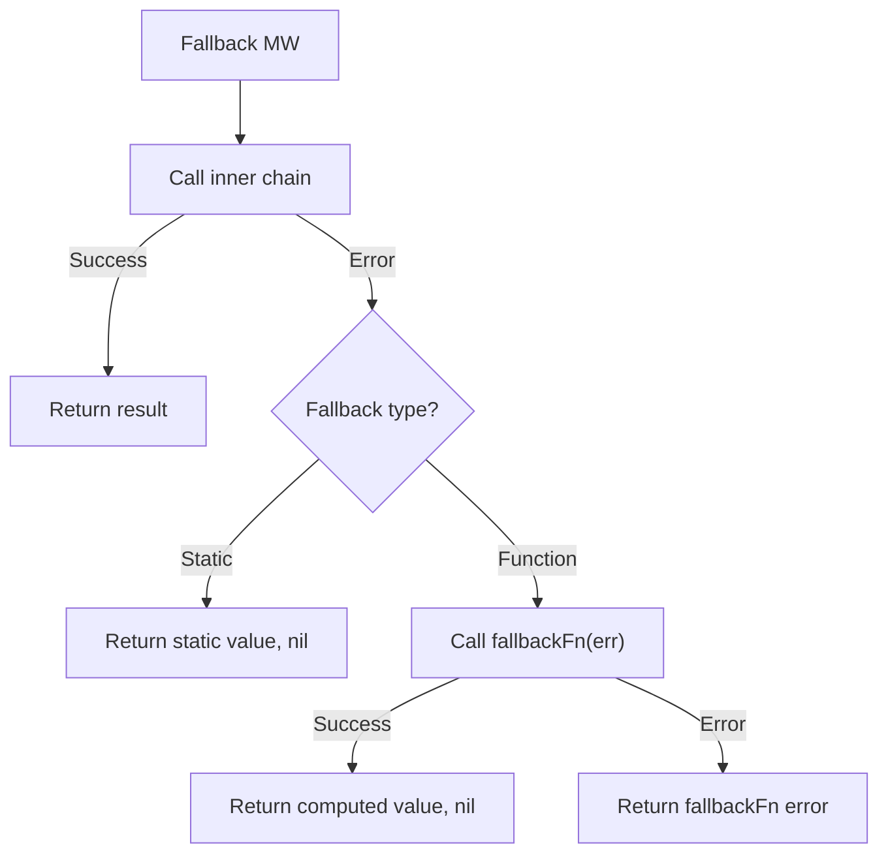

*[Read in English](README.md)*

# Exemple 09 — Fallback

Illustre le patron fallback — une derniere ligne de defense qui fournit une
valeur lorsque tout le reste echoue.

## Ce que cet exemple illustre

Quatre scenarios couvrent tous les comportements du fallback :

1. **Fallback statique** — `WithFallback("default value")` renvoie une valeur
   fixe lorsque la fonction encapsulee echoue. L'erreur est absorbee ; l'appelant
   recoit la valeur de repli avec une erreur `nil`.

2. **Fallback par fonction** — `WithFallbackFunc(fn)` appelle une fonction
   fournie par l'utilisateur avec l'erreur d'origine. Cette fonction peut
   calculer une valeur de repli dynamique ou meme renvoyer sa propre erreur.

3. **Fonction de fallback qui echoue egalement** — Si la fonction de fallback
   elle-meme renvoie une erreur, celle-ci est propagee a l'appelant. Le fallback
   est le dernier middleware de la chaine, il n'y a donc plus rien pour
   l'intercepter.

4. **Appel reussi** — Lorsque la fonction principale reussit, le fallback
   n'est jamais invoque. Le resultat passe sans aucune modification.

## Concepts cles

| Concept | Detail |
|---|---|
| `WithFallback[T](val)` | Renvoie une valeur statique de type `T` en cas d'echec |
| `WithFallbackFunc[T](fn)` | Appelle `func(error) (T, error)` en cas d'echec pour un repli dynamique |
| Absorption des erreurs | Le fallback statique renvoie toujours une erreur `nil` ; le fallback par fonction peut renvoyer une erreur |
| Ordre d'execution | Le fallback est le middleware le plus externe — il encapsule timeout, circuit breaker, retry, etc. |

## Diagramme de decision



## Quand l'utiliser

- Renvoyer du contenu en cache ou par defaut lorsque la source principale est
  indisponible (par exemple, une page "service indisponible").
- Degradation gracieuse : renvoyer une valeur par defaut sure plutot qu'une
  erreur a l'utilisateur final.
- Combiner avec retry : les retentatives tentent de recuperer, le fallback
  intercepte l'echec final.

## Execution

```bash
go run ./examples/09-fallback/
```

## Sortie attendue

```
=== Static Fallback ===
  result: "default value", err: <nil>

=== Function Fallback ===
  result: "fallback computed from error: database connection refused", err: <nil>

=== Fallback Function That Also Fails ===
  err: fallback also failed: primary failed

=== Successful Call (fallback not used) ===
  result: "primary success", err: <nil>
```
