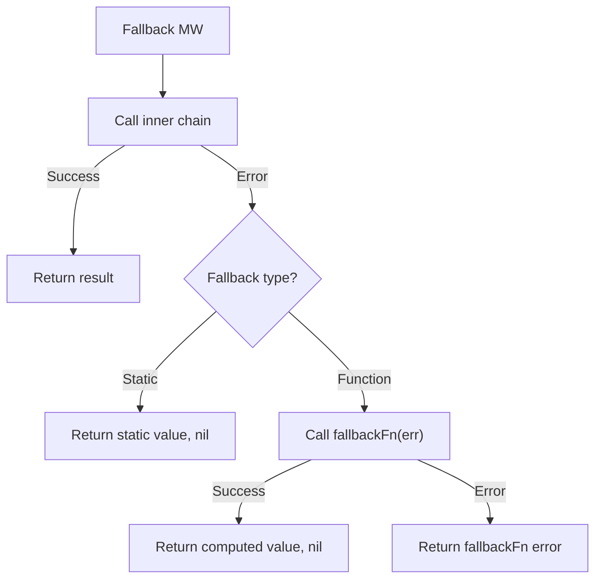

*[Read in English](README.md)*

# Exemple 09 — Fallback

Illustre le patron fallback — une dernière ligne de défense qui fournit une
valeur lorsque tout le reste a échoué.

## Ce que cet exemple illustre

Quatre scénarios couvrent tous les comportements du fallback :

1. **Fallback statique** — `WithFallback("default value")` renvoie une valeur
   fixe lorsque la fonction encapsulée échoue. L'erreur est absorbée ; l'appelant
   reçoit la valeur de repli avec une erreur `nil`.

2. **Fallback par fonction** — `WithFallbackFunc(fn)` appelle une fonction
   fournie par l'utilisateur avec l'erreur d'origine. Cette fonction peut
   calculer une valeur de repli dynamique ou même renvoyer sa propre erreur.

3. **Fonction de fallback qui échoue elle aussi** — Si la fonction de fallback
   renvoie elle-même une erreur, celle-ci est propagée à l'appelant. Le fallback
   est le dernier middleware de la chaîne, il n'y a donc plus rien pour
   l'intercepter.

4. **Appel réussi** — Lorsque la fonction principale réussit, le fallback
   n'est jamais invoqué. Le résultat passe sans aucune modification.

## Concepts clés

| Concept | Détail |
|---|---|
| `WithFallback[T](val)` | Renvoie une valeur statique de type `T` en cas d'échec |
| `WithFallbackFunc[T](fn)` | Appelle `func(error) (T, error)` en cas d'échec pour un repli dynamique |
| Absorption des erreurs | Le fallback statique renvoie toujours une erreur `nil` ; le fallback par fonction peut renvoyer une erreur |
| Ordre d'exécution | Le fallback est le middleware le plus externe — il encapsule timeout, circuit breaker, retry, etc. |

## Diagramme de décision


```mermaid
flowchart TD
    A["Fallback MW"] --> B["Call inner chain"]
    B -->|Success| C["Return result"]
    B -->|Error| D{Fallback type?}
    D -->|Static| E["Return static value, nil"]
    D -->|Function| F["Call fallbackFn(err)"]
    F -->|Success| G["Return computed value, nil"]
    F -->|Error| H["Return fallbackFn error"]
```

## Quand l'utiliser

- Renvoyer du contenu en cache ou par défaut lorsque la source principale est
  indisponible (par exemple, une page « service indisponible »).
- Dégradation gracieuse : renvoyer une valeur par défaut sûre plutôt qu'une
  erreur à l'utilisateur final.
- En combinaison avec le retry : les retentatives tentent de récupérer, le
  fallback intercepte l'échec final.

## Exécution

```bash
go run ./examples/09-fallback/
```

## Sortie attendue

```
=== Static Fallback ===
  result: "default value", err: <nil>

=== Function Fallback ===
  result: "fallback computed from error: database connection refused", err: <nil>

=== Fallback Function That Also Fails ===
  err: fallback also failed: primary failed

=== Successful Call (fallback not used) ===
  result: "primary success", err: <nil>
```
