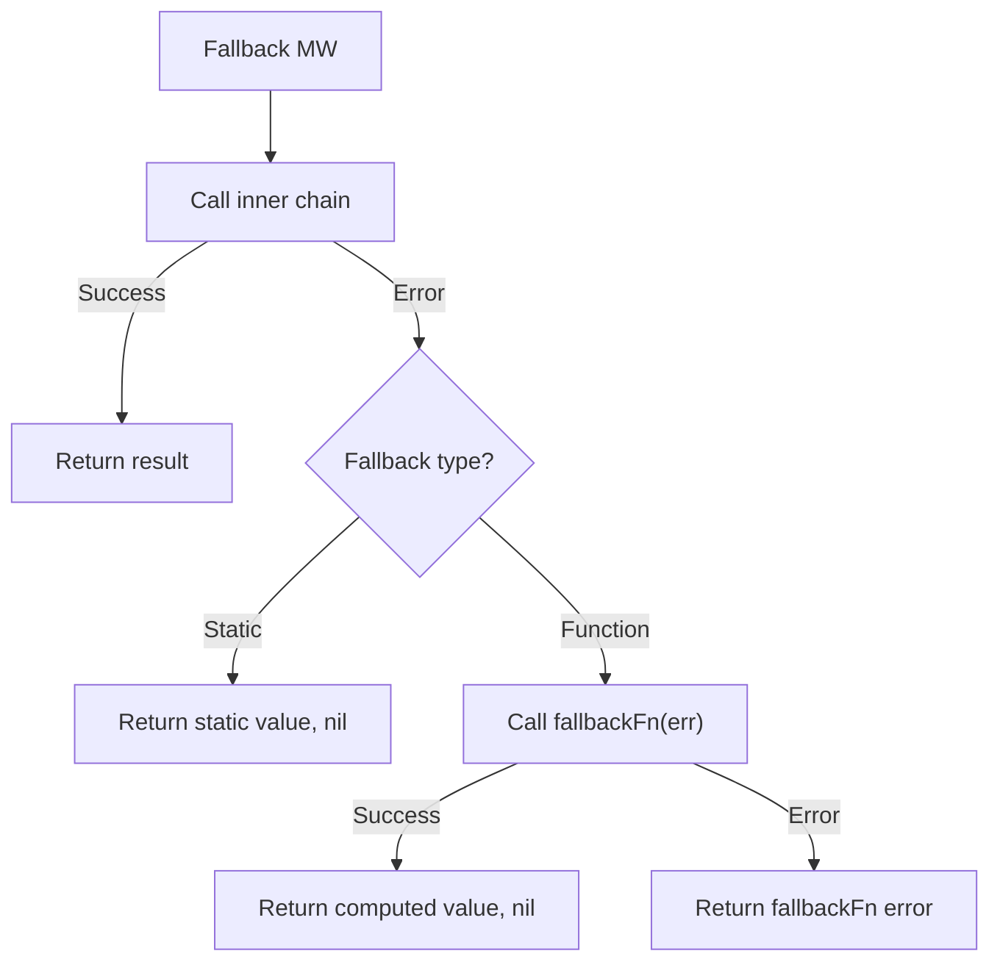

# Example 09 — Fallback

Demonstrates the fallback pattern — a last line of defence that provides a
value when everything else fails.

## What it demonstrates

Four scenarios cover all fallback behaviors:

1. **Static fallback** — `WithFallback("default value")` returns a fixed
   value when the wrapped function fails. The error is swallowed; the caller
   receives the fallback value with a `nil` error.

2. **Function fallback** — `WithFallbackFunc(fn)` calls a user-provided
   function with the original error. The function can compute a dynamic
   fallback value or even return its own error.

3. **Fallback function that also fails** — If the fallback function itself
   returns an error, that error propagates to the caller. Fallback is the
   last middleware in the chain, so there's nothing left to catch it.

4. **Successful call** — When the primary function succeeds, the fallback is
   never invoked. The result passes through untouched.

## Key concepts

| Concept | Detail |
|---|---|
| `WithFallback[T](val)` | Returns a static value of type `T` on failure |
| `WithFallbackFunc[T](fn)` | Calls `func(error) (T, error)` on failure for dynamic fallback |
| Error swallowing | Static fallback always returns `nil` error; function fallback may return an error |
| Execution order | Fallback is the outermost middleware — it wraps timeout, circuit breaker, retry, etc. |

## Decision flow



## When to use

- Returning cached/default content when the primary source is unavailable
  (e.g., "service unavailable" page).
- Graceful degradation: return a safe default rather than an error to the end
  user.
- Combine with retry: retries try to recover, fallback catches the final
  failure.

## Run

```bash
go run ./examples/09-fallback/
```

## Expected output

```
=== Static Fallback ===
  result: "default value", err: <nil>

=== Function Fallback ===
  result: "fallback computed from error: database connection refused", err: <nil>

=== Fallback Function That Also Fails ===
  err: fallback also failed: primary failed

=== Successful Call (fallback not used) ===
  result: "primary success", err: <nil>
```
