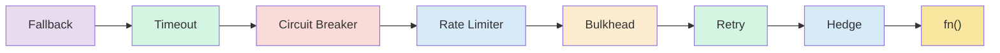

*[Read in English](README.md)*

# Exemple 10 — Politique complete

Illustre la composition de tous les patrons de resilience en une seule
politique. r8e trie automatiquement les patrons dans le bon ordre d'execution,
quel que soit l'ordre dans lequel les options sont specifiees.

## Ce que cet exemple illustre

Une seule politique est creee avec chaque patron disponible :

- **Fallback** — valeur statique en dernier recours
- **Timeout** — delai global de 2 secondes
- **Circuit breaker** — s'ouvre apres 3 echecs, recuperation en 10 secondes
- **Rate limiter** — 100 requetes par seconde
- **Bulkhead** — 10 appels concurrents
- **Retry** — 3 tentatives avec backoff exponentiel
- **Hedge** — lance un second appel apres 50 ms
- **Hooks** — callbacks d'observabilite pour retry, timeout et fallback

Trois scenarios sont executes avec la politique composee :

1. **Appel reussi** — tous les patrons laissent passer de maniere
   transparente. Le resultat de la fonction est renvoye directement.

2. **Appel en echec** — la fonction echoue systematiquement. Les retentatives
   sont epuisees (les hooks enregistrent chaque tentative), puis le fallback
   fournit la valeur finale.

3. **Retry + fallback sur une politique neuve** — demontre que le fallback
   intercepte l'erreur une fois les retentatives epuisees.

## Ordre d'execution

Les patrons sont tries automatiquement par priorite. Le middleware le plus
externe s'execute en premier :



Cet ordre garantit que :
- Le fallback intercepte tout
- Le timeout limite la duree totale d'execution
- Le circuit breaker empeche les appels vers un service en mauvaise sante
- Le rate limiter et le bulkhead protegent les ressources partagees
- Le retry et le hedge sont les plus internes — ils retentent/mettent en
  concurrence la fonction reelle

## Execution

```bash
go run ./examples/10-full-policy/
```

## Sortie attendue

Un appel reussi renvoie directement le resultat. Un appel en echec affiche
les hooks de retry se declenchant, puis la valeur de fallback renvoyee.
