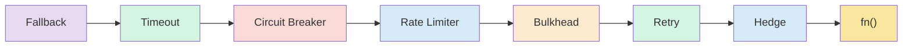

*[Read in English](README.md)*

# Exemple 10 — Politique complète

Illustre la composition de tous les patrons de résilience en une seule
politique. r8e trie automatiquement les patrons dans un ordre d'exécution
raisonnable, quel que soit l'ordre dans lequel les options sont spécifiées.

## Ce que cet exemple illustre

Une seule politique est créée avec chaque patron disponible :

- **Fallback** — valeur statique en dernier recours
- **Timeout** — délai global de 2 secondes
- **Circuit breaker** — s'ouvre après 3 échecs, récupération en 10 secondes
- **Rate limiter** — 100 requêtes par seconde
- **Bulkhead** — 10 appels concurrents
- **Retry** — 3 tentatives avec backoff exponentiel
- **Hedge** — lance un second appel après 50 ms
- **Hooks** — callbacks d'observabilité pour retry, timeout et fallback

Trois scénarios sont exécutés avec la politique composée :

1. **Appel réussi** — tous les patrons laissent passer de manière
   transparente. Le résultat de la fonction est renvoyé directement.

2. **Appel en échec** — la fonction échoue systématiquement. Les retentatives
   sont épuisées (les hooks enregistrent chaque tentative), puis le fallback
   fournit la valeur finale.

3. **Retry + fallback sur une politique neuve** — démontre que le fallback
   intercepte l'erreur une fois les retentatives épuisées.

## Ordre d'exécution

Les patrons sont triés automatiquement par priorité. Le middleware le plus
externe s'exécute en premier :


```mermaid
flowchart LR
    A[Fallback] --> B[Timeout]
    B --> C[Circuit Breaker]
    C --> D[Rate Limiter]
    D --> E[Bulkhead]
    E --> F[Retry]
    F --> G[Hedge]
    G --> H["fn()"]

    style A fill:#e8daef
    style B fill:#d5f5e3
    style C fill:#fadbd8
    style D fill:#d6eaf8
    style E fill:#fdebd0
    style F fill:#d5f5e3
    style G fill:#d6eaf8
    style H fill:#f9e79f
```

Cet ordre garantit que :
- Le fallback intercepte tout
- Le timeout limite la durée totale d'exécution
- Le circuit breaker empêche les appels vers un service en mauvaise santé
- Le rate limiter et le bulkhead protègent les ressources partagées
- Le retry et le hedge sont les plus internes — ils retentent ou mettent en
  concurrence la fonction réelle

## Exécution

```bash
go run ./examples/10-full-policy/
```

## Sortie attendue

Un appel réussi renvoie directement le résultat. Un appel en échec affiche
les hooks de retry qui se déclenchent, puis la valeur de fallback renvoyée.
