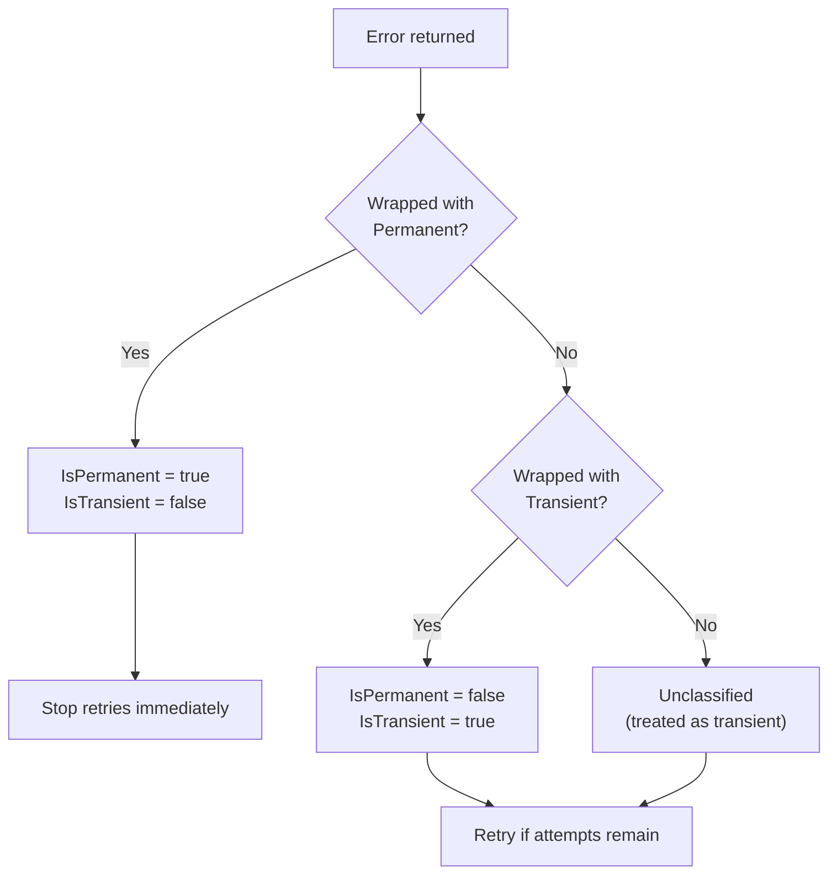

*[Read in English](README.md)*

# Exemple 11 — Classification des erreurs

Illustre comment r8e classifie les erreurs en **transitoires** ou
**permanentes** et comment cette classification contrôle le comportement
des retentatives.

## Ce que cet exemple illustre

### Comportement des retentatives selon la classe d'erreur

1. **Erreurs transitoires** — `r8e.Transient(err)` marque explicitement une
   erreur comme pouvant être retentée. La boucle de retry continue jusqu'à
   épuisement du budget de tentatives ou jusqu'au succès de la fonction.

2. **Erreurs permanentes** — `r8e.Permanent(err)` marque une erreur comme
   non retentable. Les retentatives s'arrêtent immédiatement dès la première
   occurrence, même s'il reste des tentatives dans le budget.

3. **Erreurs non classifiées** — un simple `errors.New(...)` sans wrapper.
   Les erreurs non classifiées sont **traitées comme transitoires par défaut**,
   donc toutes les tentatives de retry sont consommées.

### Inspection de la classification

Les fonctions utilitaires `IsTransient(err)` et `IsPermanent(err)` permettent
aux appelants d'inspecter la classification des erreurs :

| Erreur | `IsTransient` | `IsPermanent` |
|---|---|---|
| `Transient(err)` | `true` | `false` |
| `Permanent(err)` | `false` | `true` |
| `err` non classifiée | `true` | `false` |

## Concepts clés

| Concept | Détail |
|---|---|
| `Transient(err)` | Encapsule une erreur pour la marquer comme retentable |
| `Permanent(err)` | Encapsule une erreur pour la marquer comme non retentable |
| `IsTransient(err)` | Renvoie `true` pour les erreurs transitoires et non classifiées |
| `IsPermanent(err)` | Renvoie `true` uniquement pour les erreurs explicitement permanentes |
| Comportement par défaut | Les erreurs non classifiées sont traitées comme transitoires |

## Arbre de décision


```mermaid
flowchart TD
    A[Error returned] --> B{Wrapped with<br/>Permanent?}
    B -->|Yes| C["IsPermanent = true<br/>IsTransient = false"]
    C --> D[Stop retries immediately]

    B -->|No| E{Wrapped with<br/>Transient?}
    E -->|Yes| F["IsPermanent = false<br/>IsTransient = true"]
    E -->|No| G["Unclassified<br/>(treated as transient)"]
    F --> H[Retry if attempts remain]
    G --> H
```

## Quand l'utiliser

- Encapsuler les erreurs d'appels HTTP : les réponses 5xx sont transitoires,
  les 4xx sont permanentes.
- Encapsuler les erreurs de base de données : les erreurs de connexion sont
  transitoires, les violations de contraintes sont permanentes.
- Utiliser `RetryIf` pour un contrôle plus fin lorsque la classification des
  erreurs seule ne suffit pas.

## Exécution

```bash
go run ./examples/11-error-classification/
```
