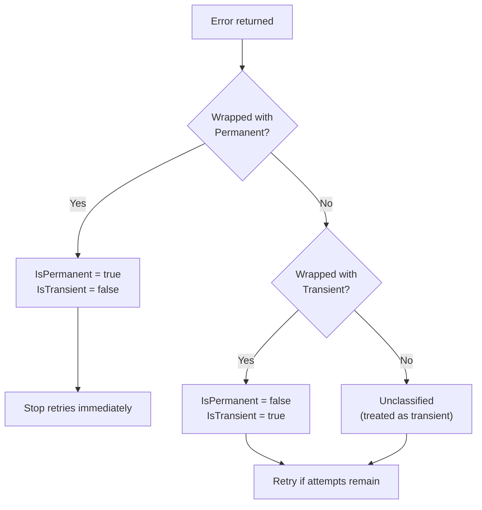

*[Lire en Francais](README.fr.md)*

# Example 11 — Error Classification

Demonstrates how r8e classifies errors as **transient** or **permanent** and
how this classification controls retry behavior.

## What it demonstrates

### Retry behavior by error class

1. **Transient errors** — `r8e.Transient(err)` explicitly marks an error as
   retriable. The retry loop continues until the attempt budget is exhausted
   or the function succeeds.

2. **Permanent errors** — `r8e.Permanent(err)` marks an error as
   non-retriable. Retries stop immediately on the first occurrence, even if
   the retry budget has remaining attempts.

3. **Unclassified errors** — plain `errors.New(...)` with no wrapper.
   Unclassified errors are **treated as transient by default**, so all retry
   attempts are consumed.

### Classification inspection

The `IsTransient(err)` and `IsPermanent(err)` helper functions let callers
inspect error classification:

| Error | `IsTransient` | `IsPermanent` |
|---|---|---|
| `Transient(err)` | `true` | `false` |
| `Permanent(err)` | `false` | `true` |
| Unclassified `err` | `true` | `false` |

## Key concepts

| Concept | Detail |
|---|---|
| `Transient(err)` | Wraps an error to mark it as retriable |
| `Permanent(err)` | Wraps an error to mark it as non-retriable |
| `IsTransient(err)` | Returns `true` for transient and unclassified errors |
| `IsPermanent(err)` | Returns `true` only for explicitly permanent errors |
| Default behavior | Unclassified errors are treated as transient |

## Decision tree



## When to use

- Wrap errors from HTTP calls: 5xx responses are transient, 4xx are permanent.
- Wrap database errors: connection errors are transient, constraint violations
  are permanent.
- Use `RetryIf` for finer-grained control when error classification alone
  isn't sufficient.

## Run

```bash
go run ./examples/11-error-classification/
```
