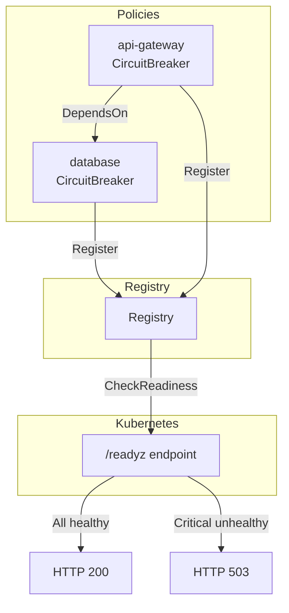

*[Read in English](README.md)*

# Exemple 13 — Health & Readiness

Montre le reporting de sante des policies, les dependances hierarchiques et
l'exposition d'un endpoint HTTP `/readyz` compatible Kubernetes.

## Ce que cet exemple demontre

### Reporting de sante

Toute policy dotee d'un circuit breaker rapporte automatiquement son etat de
sante via l'interface `HealthReporter`. La methode `HealthStatus()` retourne :

- **Name** — le nom de la policy
- **Healthy** — `true` si le circuit breaker est ferme ou semi-ouvert
- **State** — etat lisible (`"healthy"`, `"circuit_open"`, etc.)
- **Criticality** — `CriticalityNone`, `CriticalityDegraded` ou
  `CriticalityCritical`

### Dependances hierarchiques

`DependsOn(dbPolicy)` declare que la policy `api-gateway` depend de la policy
`database`. Lorsque le circuit breaker de la base de donnees s'ouvre :

- `dbPolicy.HealthStatus().Healthy` devient `false`
- `apiPolicy.HealthStatus()` inclut la base de donnees comme dependance dans
  son statut

### Registry et readiness

Les deux policies s'enregistrent dans le meme `Registry`. Le registry agrege
la sante de toutes les policies enregistrees :

- `CheckReadiness()` retourne `Ready: true` uniquement si aucune policy
  critique n'est en mauvaise sante
- Lorsque le breaker de la base de donnees s'ouvre, `Ready` devient `false`

### Endpoint HTTP `/readyz`

`ReadinessHandler(reg)` retourne un `http.Handler` qui :

- Retourne HTTP 200 avec un corps JSON lorsque toutes les policies critiques
  sont en bonne sante
- Retourne HTTP 503 lorsqu'une policy critique est en mauvaise sante

L'exemple utilise `httptest.NewRecorder` pour demonstrer l'endpoint sans
demarrer un veritable serveur.

## Architecture



## Concepts cles

| Concept | Detail |
|---|---|
| `HealthReporter` | Interface implementee par les policies dotees d'un circuit breaker |
| `DependsOn(reporters...)` | Declare les dependances de sante hierarchiques |
| `Registry` | Agrege la sante de toutes les policies enregistrees |
| `CheckReadiness()` | Retourne un `ReadinessStatus` avec l'etat de readiness global |
| `ReadinessHandler(reg)` | Handler HTTP pour les sondes Kubernetes `/readyz` |

## Execution

```bash
go run ./examples/13-health-readiness/
```

## Sortie attendue

L'etat de sante initial est entierement sain. Apres avoir declenche des
erreurs sur la base de donnees, la policy de base de donnees devient en
mauvaise sante, la readiness devient `false` et l'endpoint HTTP retourne 503.
