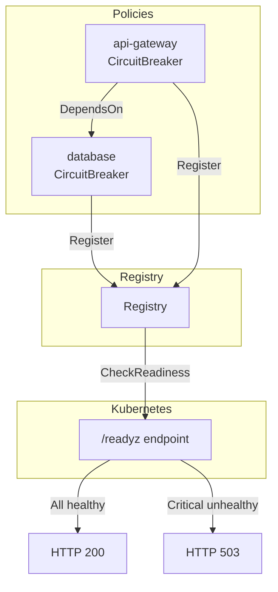

*[Read in English](README.md)*

# Exemple 13 — Health & Readiness

Montre le reporting de santé des policies, les dépendances hiérarchiques et
l'exposition d'un endpoint HTTP `/readyz` compatible Kubernetes.

## Ce que cet exemple démontre

### Reporting de santé

Toute policy dotée d'un circuit breaker rapporte automatiquement son état de
santé via l'interface `HealthReporter`. La méthode `HealthStatus()` retourne :

- **Name** — le nom de la policy
- **Healthy** — `true` si le circuit breaker est fermé ou semi-ouvert
- **State** — état lisible (`"healthy"`, `"circuit_open"`, etc.)
- **Criticality** — `CriticalityNone`, `CriticalityDegraded` ou
  `CriticalityCritical`

### Dépendances hiérarchiques

`DependsOn(dbPolicy)` déclare que la policy `api-gateway` dépend de la policy
`database`. Lorsque le circuit breaker de la base de données s'ouvre :

- `dbPolicy.HealthStatus().Healthy` devient `false`
- `apiPolicy.HealthStatus()` inclut la base de données comme dépendance dans
  son statut

### Registry et readiness

Les deux policies s'enregistrent dans le même `Registry`. Le registry agrège
la santé de toutes les policies enregistrées :

- `CheckReadiness()` retourne `Ready: true` uniquement si aucune policy
  critique n'est en mauvaise santé
- Lorsque le breaker de la base de données s'ouvre, `Ready` devient `false`

### Endpoint HTTP `/readyz`

`r8ehttp.ReadinessHandler(reg)` (le paquet edge HTTP) retourne un
`http.Handler` qui :

- Retourne HTTP 200 avec un corps JSON lorsque toutes les policies critiques
  sont en bonne santé
- Retourne HTTP 503 lorsqu'une policy critique est en mauvaise santé

L'exemple utilise `httptest.NewRecorder` pour démontrer l'endpoint sans
démarrer un véritable serveur.

## Architecture


```mermaid
flowchart TD
    subgraph Registry
        R[Registry]
    end

    subgraph Policies
        DB["database<br/>CircuitBreaker"]
        API["api-gateway<br/>CircuitBreaker"]
    end

    API -->|DependsOn| DB
    DB -->|Register| R
    API -->|Register| R

    subgraph Kubernetes
        K8S["/readyz endpoint"]
    end

    R -->|CheckReadiness| K8S

    K8S -->|All healthy| OK[HTTP 200]
    K8S -->|Critical unhealthy| FAIL[HTTP 503]
```

## Concepts clés

| Concept | Détail |
|---|---|
| `HealthReporter` | Interface implémentée par les policies dotées d'un circuit breaker |
| `DependsOn(reporters...)` | Déclare les dépendances de santé hiérarchiques |
| `Registry` | Agrège la santé de toutes les policies enregistrées |
| `CheckReadiness()` | Retourne un `ReadinessStatus` avec l'état de readiness global |
| `r8ehttp.ReadinessHandler(reg)` | Handler HTTP pour les sondes Kubernetes `/readyz` |

## Exécution

```bash
go run ./examples/13-health-readiness/
```

## Sortie attendue

L'état de santé initial est entièrement sain. Après avoir déclenché des
erreurs sur la base de données, la policy de base de données passe en
mauvaise santé, la readiness devient `false` et l'endpoint HTTP retourne 503.
