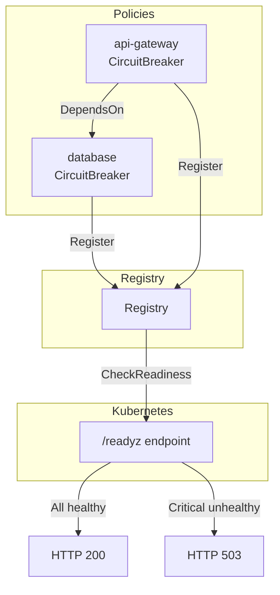

# Example 13 — Health & Readiness

Demonstrates policy health reporting, hierarchical dependencies, and
exposing a Kubernetes-compatible `/readyz` HTTP endpoint.

## What it demonstrates

### Health reporting

Every policy with a circuit breaker automatically reports health status via
the `HealthReporter` interface. The `HealthStatus()` method returns:

- **Name** — the policy name
- **Healthy** — `true` if the circuit breaker is closed or half-open
- **State** — human-readable state (`"healthy"`, `"circuit_open"`, etc.)
- **Criticality** — `CriticalityNone`, `CriticalityDegraded`, or
  `CriticalityCritical`

### Hierarchical dependencies

`DependsOn(dbPolicy)` declares that the `api-gateway` policy depends on the
`database` policy. When the database circuit breaker opens:

- `dbPolicy.HealthStatus().Healthy` becomes `false`
- `apiPolicy.HealthStatus()` includes the database as a dependency in its
  status

### Registry and readiness

Both policies register in the same `Registry`. The registry aggregates health
from all registered policies:

- `CheckReadiness()` returns `Ready: true` only if no critical policy is
  unhealthy
- When the database breaker opens, `Ready` becomes `false`

### HTTP `/readyz` endpoint

`ReadinessHandler(reg)` returns an `http.Handler` that:

- Returns HTTP 200 with JSON body when all critical policies are healthy
- Returns HTTP 503 when any critical policy is unhealthy

The example uses `httptest.NewRecorder` to demonstrate the endpoint without
starting a real server.

## Architecture



## Key concepts

| Concept | Detail |
|---|---|
| `HealthReporter` | Interface implemented by policies with a circuit breaker |
| `DependsOn(reporters...)` | Declares hierarchical health dependencies |
| `Registry` | Aggregates health from all registered policies |
| `CheckReadiness()` | Returns `ReadinessStatus` with overall readiness |
| `ReadinessHandler(reg)` | HTTP handler for Kubernetes `/readyz` probes |

## Run

```bash
go run ./examples/13-health-readiness/
```

## Expected output

Initial health is all healthy. After triggering database failures, the
database policy becomes unhealthy, readiness becomes `false`, and the HTTP
endpoint returns 503.
