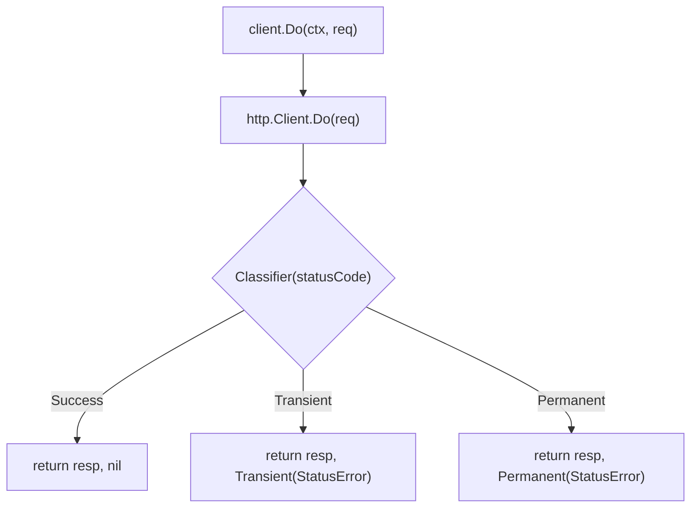

*[Read in English](README.md)*

# Exemple 17 — httpx Basique

Demonstration basique de l'adaptateur `httpx`, montrant comment envelopper un
client HTTP avec une politique de resilience et classifier les codes de statut
HTTP.

## Ce que cet exemple demontre

- Creation d'un `httpx.Client` avec `NewClient`, combinant un `http.Client`,
  une fonction `Classifier` et des options r8e (timeout).
- Utilisation de `client.Do` pour executer des requetes a travers la politique
  de resilience.
- Gestion des trois chemins de classification : **Success** (2xx),
  **Permanent** (4xx) et **Transient** (5xx).
- Extraction du `StatusError` depuis la chaine d'erreurs via `errors.As` pour
  inspecter la reponse originale et le code de statut.

## Concepts cles

| Concept | Detail |
|---|---|
| `httpx.NewClient` | Cree un client HTTP resilient avec un nom, un http.Client, un classificateur et des options r8e |
| `httpx.Classifier` | `func(int) ErrorClass` — associe les codes de statut a `Success`, `Transient` ou `Permanent` |
| `httpx.StatusError` | Type d'erreur portant le `*http.Response` original pour inspection |
| `client.Do` | Execute `*http.Request` a travers la politique, retourne `(*http.Response, error)` |
| `errors.As` | Extrait `*httpx.StatusError` depuis la chaine d'erreurs |

## Flux de classification



## Execution

```bash
go run ./examples/17-httpx-basic/
```

## Sortie attendue

```
=== Success (200 OK) ===
  status: 200

=== Permanent Error (400 Bad Request) ===
  error: permanent: http status 400
  is permanent: true
  status code: 400
  response available: true

=== Transient Error (503 Service Unavailable) ===
  error: transient: http status 503
  is transient: true
  status code: 503
```
