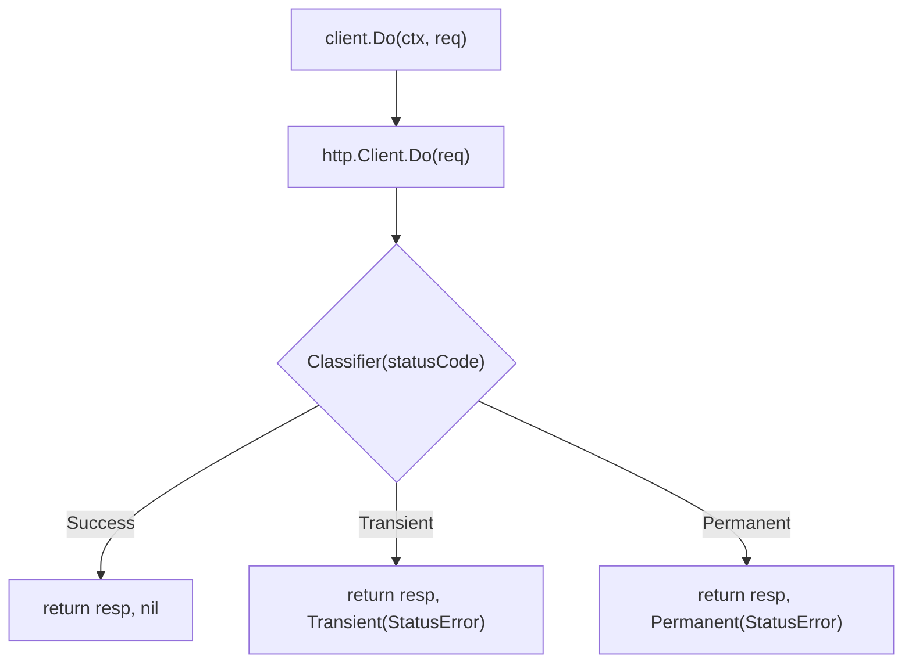

*[Read in English](README.md)*

# Exemple 17 — httpx Basique

Démonstration basique de l'adaptateur `httpx`, montrant comment envelopper un
client HTTP avec une politique de résilience et classifier les codes de statut
HTTP.

## Ce que cet exemple démontre

- Création d'un `httpx.Client` avec `NewClient`, combinant un `http.Client`,
  une fonction `Classifier` et des options r8e (timeout).
- Utilisation de `client.Do` pour exécuter des requêtes à travers la politique
  de résilience.
- Gestion des trois chemins de classification : **Success** (2xx),
  **Permanent** (4xx) et **Transient** (5xx).
- Extraction du `StatusError` depuis la chaîne d'erreurs via `errors.As` pour
  inspecter la réponse originale et le code de statut.

## Concepts clés

| Concept | Détail |
|---|---|
| `httpx.NewClient` | Crée un client HTTP résilient avec un nom, un http.Client, un classificateur et des options r8e |
| `httpx.Classifier` | `func(int) ErrorClass` — associe les codes de statut à `Success`, `Transient` ou `Permanent` |
| `httpx.StatusError` | Type d'erreur portant le `*http.Response` original pour inspection |
| `client.Do` | Exécute `*http.Request` à travers la politique, retourne `(*http.Response, error)` |
| `errors.As` | Extrait `*httpx.StatusError` depuis la chaîne d'erreurs |

## Flux de classification


```mermaid
flowchart TD
    A["client.Do(ctx, req)"] --> B["http.Client.Do(req)"]
    B --> C{"Classifier(statusCode)"}
    C -->|Success| D["return resp, nil"]
    C -->|Transient| E["return resp, Transient(StatusError)"]
    C -->|Permanent| F["return resp, Permanent(StatusError)"]
```

## Exécution

```bash
go run ./examples/17-httpx-basic/
```

## Sortie attendue

```
=== Success (200 OK) ===
  status: 200

=== Permanent Error (400 Bad Request) ===
  error: permanent: http status 400
  is permanent: true
  status code: 400
  response available: true

=== Transient Error (503 Service Unavailable) ===
  error: transient: http status 503
  is transient: true
  status code: 503
```
