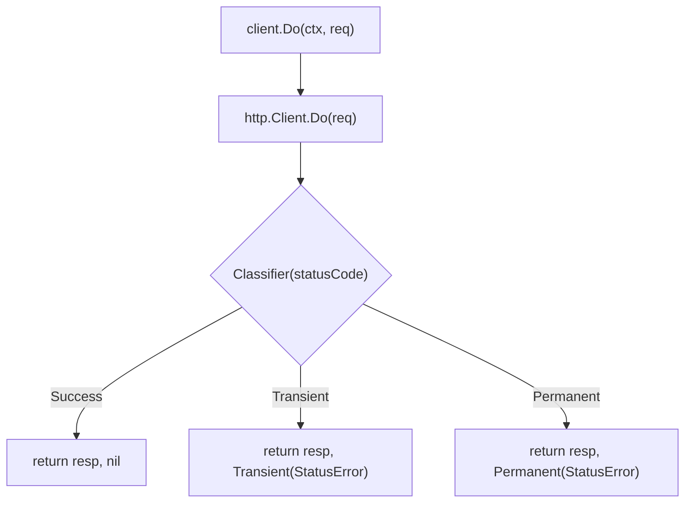

*[Lire en Francais](README.fr.md)*

# Example 17 — httpx Basic

Basic demonstration of the `httpx` adapter, showing how to wrap an HTTP client
with a resilience policy and classify HTTP status codes.

## What it demonstrates

- Creating an `httpx.Client` with `NewClient`, combining an `http.Client`, a
  `Classifier` function, and r8e options (timeout).
- Using `client.Do` to execute requests through the resilience policy.
- Handling the three classification paths: **Success** (2xx), **Permanent**
  (4xx), and **Transient** (5xx).
- Extracting the `StatusError` from the error chain via `errors.As` to inspect
  the original response and status code.

## Key concepts

| Concept | Detail |
|---|---|
| `httpx.NewClient` | Creates a resilient HTTP client with a name, http.Client, classifier, and r8e options |
| `httpx.Classifier` | `func(int) ErrorClass` — maps status codes to `Success`, `Transient`, or `Permanent` |
| `httpx.StatusError` | Error type carrying the original `*http.Response` for inspection |
| `client.Do` | Executes `*http.Request` through the policy, returns `(*http.Response, error)` |
| `errors.As` | Extracts `*httpx.StatusError` from the error chain |

## Classification flow



## Run

```bash
go run ./examples/17-httpx-basic/
```

## Expected output

```
=== Success (200 OK) ===
  status: 200

=== Permanent Error (400 Bad Request) ===
  error: permanent: http status 400
  is permanent: true
  status code: 400
  response available: true

=== Transient Error (503 Service Unavailable) ===
  error: transient: http status 503
  is transient: true
  status code: 503
```
