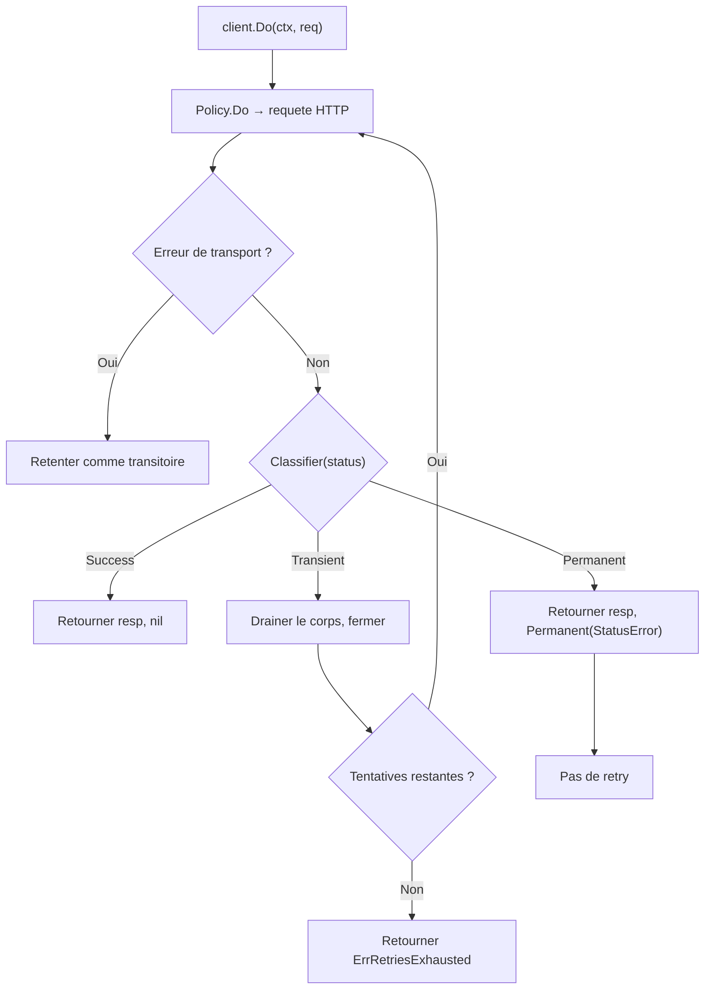

*[Read in English](README.md)*

# Exemple 18 — httpx Retry

Demontre l'adaptateur `httpx` avec retry, montrant la recuperation apres des
echecs transitoires, l'epuisement des tentatives, le court-circuit des erreurs
permanentes et la gestion du rate-limit (429).

## Ce que cet exemple demontre

### Recuperation transitoire

Un serveur retourne 503 deux fois, puis 200. Le `httpx.Client` avec retry
configure retente automatiquement les echecs transitoires et recupere a la
troisieme tentative. Le corps de la reponse est draine et ferme a chaque
retentative transitoire afin que les connexions TCP soient reutilisees.

### Tentatives epuisees

Lorsque le serveur retourne toujours 503, toutes les tentatives sont
consommees. L'erreur encapsule `r8e.ErrRetriesExhausted` et le dernier
`StatusError` est extractible via `errors.As`.

### L'erreur permanente arrete les retentatives

Une reponse 400 est classifiee comme permanente. Meme avec 5 retentatives
configurees, le client s'arrete apres une seule tentative — aucun budget de
retry n'est gaspille.

### Recuperation apres rate-limit (429)

Un 429 (Too Many Requests) est classifie comme transitoire. Le client retente
et reussit a la tentative suivante.

## Concepts cles

| Concept | Detail |
|---|---|
| `WithRetry` | Configure le retry avec un nombre max de tentatives et une strategie de backoff |
| Classification `Transient` | 429, 502, 503, 504 declenchent un retry |
| Classification `Permanent` | 4xx (sauf 429) arrete immediatement les retentatives |
| `ErrRetriesExhausted` | Erreur sentinelle lorsque toutes les tentatives echouent |
| `StatusError` | Extractible depuis la chaine d'erreurs meme apres epuisement des tentatives |
| Drainage du corps au retry | Les reponses transitoires ont leur corps draine et ferme automatiquement |

## Flux de retry avec httpx



## Execution

```bash
go run ./examples/18-httpx-retry/
```

## Sortie attendue

```
=== Transient Recovery (503 → 503 → 200) ===
  server: attempt 1
  [hook] retry #1: transient: http status 503
  server: attempt 2
  [hook] retry #2: transient: http status 503
  server: attempt 3
  success! status: 200

=== Retries Exhausted (always 503) ===
  error: retries exhausted: transient: http status 503
  retries exhausted: true
  last status code: 503

=== Permanent Stops Retries (400 on first attempt) ===
  server: attempt 1
  error: permanent: http status 400
  is permanent: true
  only 1 attempt (retries skipped)

=== Rate-Limited Recovery (429 → 200) ===
  server: attempt 1
  server: attempt 2
  success! status: 200
```
