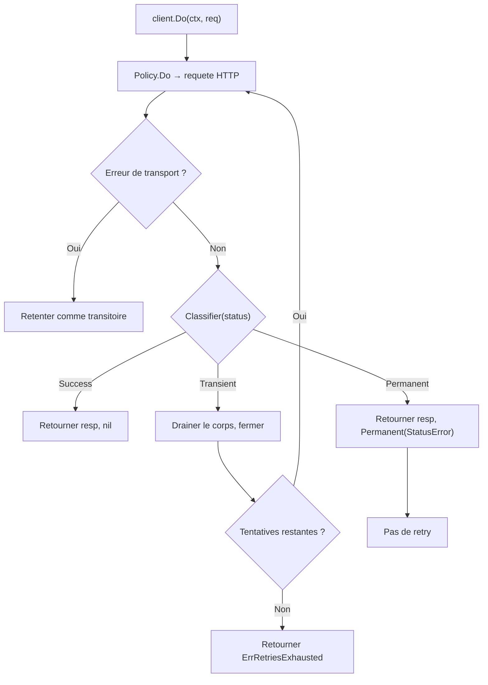

*[Read in English](README.md)*

# Exemple 18 — httpx Retry

Démontre l'adaptateur `httpx` avec retry, en montrant la récupération après des
échecs transitoires, l'épuisement des tentatives, le court-circuit des erreurs
permanentes et la gestion du rate-limit (429).

## Ce que cet exemple démontre

### Récupération transitoire

Un serveur retourne 503 deux fois, puis 200. Le `httpx.Client` avec retry
configuré retente automatiquement les échecs transitoires et récupère à la
troisième tentative. Le corps de la réponse est drainé et fermé à chaque
retentative transitoire afin que les connexions TCP soient réutilisées.

### Tentatives épuisées

Lorsque le serveur retourne toujours 503, toutes les tentatives sont
consommées. L'erreur encapsule `r8e.ErrRetriesExhausted` et le dernier
`StatusError` est extractible via `errors.As`.

### L'erreur permanente arrête les retentatives

Une réponse 400 est classifiée comme permanente. Même avec 5 retentatives
configurées, le client s'arrête après une seule tentative — aucun budget de
retry n'est gaspillé.

### Récupération après rate-limit (429)

Un 429 (Too Many Requests) est classifié comme transitoire. Le client retente
et réussit à la tentative suivante.

## Concepts clés

| Concept | Détail |
|---|---|
| `WithRetry` | Configure le retry avec un nombre max de tentatives et une stratégie de backoff |
| Classification `Transient` | 429, 502, 503, 504 déclenchent un retry |
| Classification `Permanent` | 4xx (sauf 429) arrête immédiatement les retentatives |
| `ErrRetriesExhausted` | Erreur sentinelle lorsque toutes les tentatives échouent |
| `StatusError` | Extractible depuis la chaîne d'erreurs même après épuisement des tentatives |
| Drainage du corps au retry | Les réponses transitoires ont leur corps drainé et fermé automatiquement |

## Flux de retry avec httpx


```mermaid
flowchart TD
    A["client.Do(ctx, req)"] --> B["Policy.Do → requete HTTP"]
    B --> C{Erreur de transport ?}
    C -->|Oui| D[Retenter comme transitoire]
    C -->|Non| E{"Classifier(status)"}
    E -->|Success| F[Retourner resp, nil]
    E -->|Transient| G["Drainer le corps, fermer"]
    G --> H{Tentatives restantes ?}
    H -->|Oui| B
    H -->|Non| I["Retourner ErrRetriesExhausted"]
    E -->|Permanent| J["Retourner resp, Permanent(StatusError)"]
    J --> K[Pas de retry]
```

## Exécution

```bash
go run ./examples/18-httpx-retry/
```

## Sortie attendue

```
=== Transient Recovery (503 → 503 → 200) ===
  server: attempt 1
  [hook] retry #1: transient: http status 503
  server: attempt 2
  [hook] retry #2: transient: http status 503
  server: attempt 3
  success! status: 200

=== Retries Exhausted (always 503) ===
  error: retries exhausted: transient: http status 503
  retries exhausted: true
  last status code: 503

=== Permanent Stops Retries (400 on first attempt) ===
  server: attempt 1
  error: permanent: http status 400
  is permanent: true
  only 1 attempt (retries skipped)

=== Rate-Limited Recovery (429 → 200) ===
  server: attempt 1
  server: attempt 2
  success! status: 200
```
