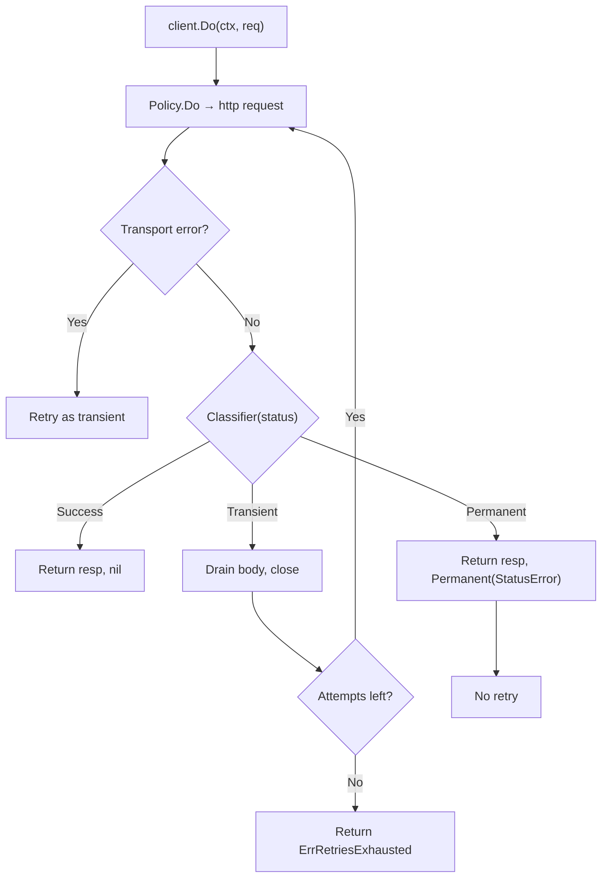

*[Lire en Francais](README.fr.md)*

# Example 18 — httpx Retry

Demonstrates the `httpx` adapter with retry, showing transient failure recovery,
retries exhausted, permanent error short-circuit, and rate-limit (429) handling.

## What it demonstrates

### Transient recovery

A server returns 503 twice, then 200. The `httpx.Client` with retry configured
automatically retries the transient failures and recovers on the third attempt.
The response body is drained and closed on each transient retry so TCP
connections are reused.

### Retries exhausted

When the server always returns 503, all retry attempts are consumed. The error
wraps `r8e.ErrRetriesExhausted` and the last `StatusError` is extractable via
`errors.As`.

### Permanent stops retries

A 400 response is classified as permanent. Even with 5 retries configured, the
client stops after a single attempt — no retry budget is wasted.

### Rate-limited recovery (429)

A 429 (Too Many Requests) is classified as transient. The client retries and
succeeds on the next attempt.

## Key concepts

| Concept | Detail |
|---|---|
| `WithRetry` | Configures retry with max attempts and backoff strategy |
| `Transient` classification | 429, 502, 503, 504 trigger retry |
| `Permanent` classification | 4xx (except 429) stops retries immediately |
| `ErrRetriesExhausted` | Sentinel error when all attempts fail |
| `StatusError` | Extractable from error chain even after retries exhausted |
| Body drain on retry | Transient responses have body drained and closed automatically |

## Retry flow with httpx



## Run

```bash
go run ./examples/18-httpx-retry/
```

## Expected output

```
=== Transient Recovery (503 → 503 → 200) ===
  server: attempt 1
  [hook] retry #1: transient: http status 503
  server: attempt 2
  [hook] retry #2: transient: http status 503
  server: attempt 3
  success! status: 200

=== Retries Exhausted (always 503) ===
  error: retries exhausted: transient: http status 503
  retries exhausted: true
  last status code: 503

=== Permanent Stops Retries (400 on first attempt) ===
  server: attempt 1
  error: permanent: http status 400
  is permanent: true
  only 1 attempt (retries skipped)

=== Rate-Limited Recovery (429 → 200) ===
  server: attempt 1
  server: attempt 2
  success! status: 200
```
