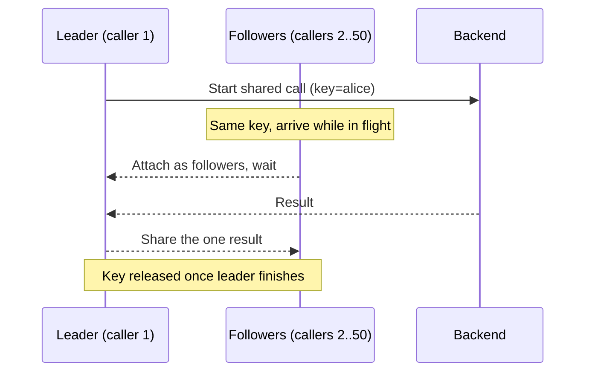

*[Read in English](README.md)*

# Exemple 20 — Fusion de requêtes (Singleflight)

Illustre la fusion de requêtes (*coalescing*), qui regroupe une rafale d'appels
concurrents portant sur la même clé en une seule exécution partagée en aval — le
remède classique à la ruée sur le cache (*cache stampede*).

## Ce que cet exemple illustre

Une politique est configurée avec `WithCoalesce(userKey)`, où `userKey` lit
l'identifiant d'utilisateur estampillé dans le contexte de l'appel. Lorsque
plusieurs appels partagent une clé et se chevauchent dans le temps, seul le
**leader** exécute le travail ; chaque **suiveur** (*follower*) qui arrive
pendant que le leader est en cours attend et partage ce résultat unique.

L'exemple déroule deux scénarios :

1. **Ruée sur une clé chaude.** 50 goroutines appellent toutes `Do` pour
   l'utilisateur `alice` en même temps — modélisant le moment où une clé de
   cache chaude expire et où toutes les requêtes ratent ensemble. Un service en
   aval simulé de 50 ms maintient le leader en cours assez longtemps pour que
   les autres s'y rattachent. La sortie montre **50 appelants → 1 appel
   backend**, ainsi que la répartition leader/suiveur (un leader, 49 suiveurs
   économisés).
2. **Des clés distinctes s'exécutent indépendamment.** Trois goroutines
   appellent pour `bob`, `carol` et `dave`. Comme la fusion s'appuie sur
   l'identité, des clés différentes ne sont *pas* regroupées : la sortie montre
   **3 clés distinctes → 3 appels backend**. Une fois que chaque groupe s'est
   vidé, la jauge en vol revient à zéro — le travail fusionné n'a pas débordé
   au-delà de ses appelants.

## Fonctionnement



## Concepts clés

| Concept | Détail |
|---|---|
| `WithCoalesce(keyFn)` | Regroupe les appels de même clé qui se chevauchent en une seule exécution partagée ; `keyFn` dérive la clé du contexte de l'appel |
| `WithTimeout(...)` | **Obligatoire** — l'appel partagé s'exécute sous un contexte détaché, un timeout doit donc le borner (sinon `NewPolicy` panique avec `ErrCoalesceWithoutTimeout`) |
| Leader / suiveur | Le leader exécute le travail ; les suiveurs attendent et partagent son résultat. Leur rapport est le taux de déduplication |
| Une clé vide se désengage | Retourner `""` depuis `keyFn` exécute cet appel seul, sans fusion |
| `CoalesceLeaders` / `CoalesceFollowers` / `CoalesceInFlight` | Compteurs des leaders et des appels économisés, et jauge en vol en direct |

## Quand l'utiliser

- Devant (ou derrière) un cache, pour absorber les ratés simultanés lorsqu'une
  clé chaude expire — transformant N appels aval identiques en un seul.
- Pour des lectures majoritaires et idempotentes où chaque appelant veut le
  *même* résultat pour une clé ; la fusion renvoie une valeur partagée unique à
  tous.
- Ce n'est pas un cache en soi : elle ne déduplique que les appels qui se
  chevauchent dans le temps. Un appel ultérieur pour la même clé, après la fin
  du leader, repart de zéro — associez-la à un cache pour une vraie réutilisation
  dans le temps.

## Exécution

```bash
go run ./examples/20-coalesce/
```

## Sortie attendue

Deux sections. La première rapporte 50 appelants se regroupant en 1 appel
backend, avec 1 leader et 49 suiveurs. La seconde rapporte 3 clés distinctes
produisant 3 appels backend et un décompte en vol de 0. La répartition
leader/suiveur de la ruée est stable grâce au service en aval lent, mais
certains détails dépendants du minutage peuvent varier d'une exécution à
l'autre.
