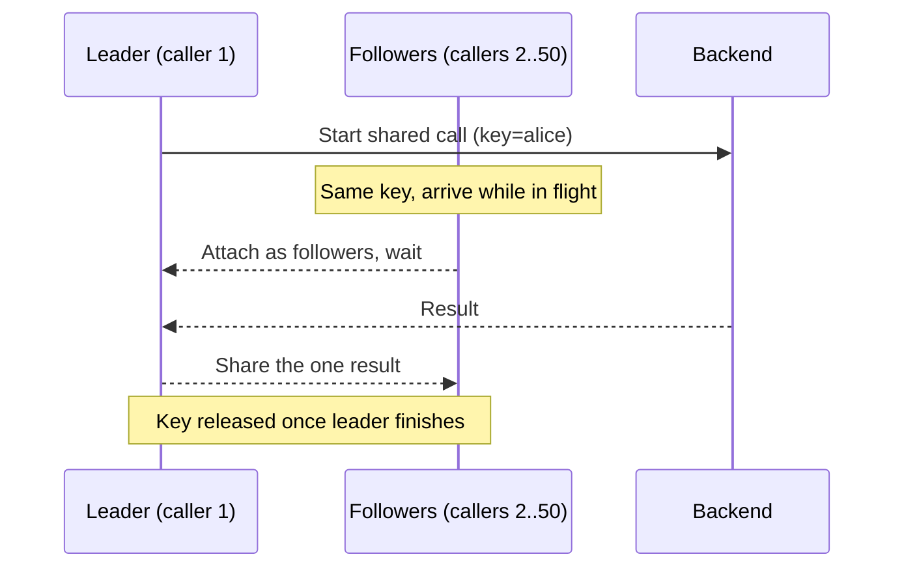

*[Lire en Français](README.fr.md)*

# Example 20 — Request Coalescing (Singleflight)

Demonstrates request coalescing, which collapses a burst of concurrent calls for
the same key into a single shared downstream execution — the classic fix for
cache stampede.

## What it demonstrates

A policy is configured with `WithCoalesce(userKey)`, where `userKey` reads the
user id stamped into the call context. When several calls share a key and
overlap in time, only the **leader** runs the work; every **follower** that
arrives while the leader is in flight waits for and shares that one result.

The example runs two scenarios:

1. **Stampede on one hot key.** 50 goroutines all call `Do` for user `alice` at
   once — modelling the moment a hot cache key expires and every request misses
   together. A 50ms simulated backend keeps the leader in flight long enough for
   the others to attach. The output shows **50 callers → 1 backend call**, plus
   the leader/follower split (one leader, 49 followers saved).
2. **Distinct keys run independently.** Three goroutines call for `bob`,
   `carol`, and `dave`. Because coalescing keys on identity, different keys are
   *not* merged: the output shows **3 distinct keys → 3 backend calls**. Once
   every group drains, the in-flight gauge returns to zero — the merged work
   didn't leak past its callers.

## How it works



## Key concepts

| Concept | Detail |
|---|---|
| `WithCoalesce(keyFn)` | Collapses overlapping same-key calls into one shared execution; `keyFn` derives the key from the call context |
| `WithTimeout(...)` | **Required** — the shared call runs under a detached context, so a timeout must bound it (`NewPolicy` panics with `ErrCoalesceWithoutTimeout` otherwise) |
| Leader / follower | The leader runs the work; followers wait and share its result. Their ratio is the dedup rate |
| Empty key opts out | Returning `""` from `keyFn` runs that call on its own, uncoalesced |
| `CoalesceLeaders` / `CoalesceFollowers` / `CoalesceInFlight` | Counters of leaders and saved calls, and the live in-flight gauge |

## When to use

- In front of (or behind) a cache, to absorb the simultaneous misses when a hot
  key expires — turning N identical downstream calls into one.
- For read-mostly, idempotent lookups where every caller wants the *same*
  result for a key; coalescing returns one shared value to all of them.
- Not a cache itself: it only dedupes calls that overlap in time. A later call
  for the same key, after the leader finished, starts fresh — pair it with a
  cache for actual reuse across time.

## Run

```bash
go run ./examples/20-coalesce/
```

## Expected output

Two sections. The first reports 50 callers collapsing to 1 backend call, with 1
leader and 49 followers. The second reports 3 distinct keys producing 3 backend
calls and an in-flight count of 0. The leader/follower split for the stampede is
stable thanks to the slow backend, but exact timing-dependent details can vary
run to run.
