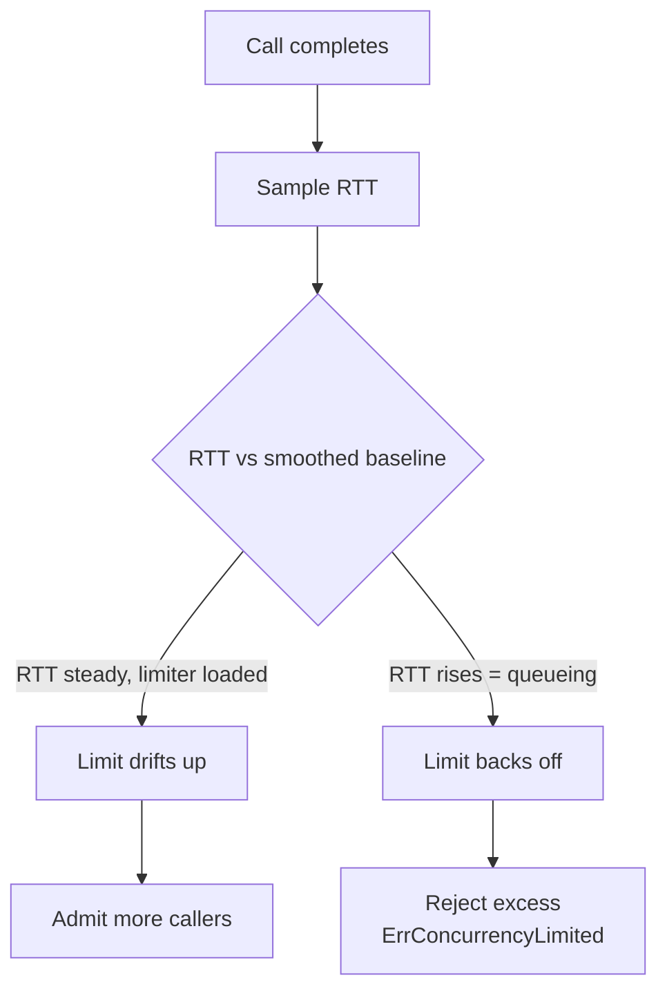

*[Read in English](README.md)*

# Exemple 21 — Concurrence adaptative

Illustre un limiteur de concurrence adaptatif qui ajuste son propre plafond à
partir de la latence observée, à l'aide de l'algorithme Gradient2 de Netflix —
ainsi vous n'avez jamais à deviner la taille d'un bulkhead fixe.

## Ce que cet exemple illustre

Une politique est configurée avec `WithAdaptiveConcurrency(InitialLimit(10),
MinLimit(2), MaxLimit(50))`. Chaque appel terminé échantillonne son temps
d'aller-retour (RTT) ; lorsque le RTT courant dépasse une base lissée à long
terme — la signature d'une file d'attente en aval — la limite est abaissée, et
lorsque la latence est stable, la limite remonte progressivement. Les appels qui
arrivent alors que le nombre d'appels en vol atteint déjà la limite sont rejetés
avec `ErrConcurrencyLimited`.

L'exemple pilote le limiteur avec un service en aval simulé dont il modifie la
latence à l'exécution :

1. **Charge saine.** Avec un service en aval rapide de 5 ms et 40 appelants qui
   bombardent une limite démarrant à 10, la latence reste stable et la demande
   élevée, donc Gradient2 fait dériver la limite *vers le haut* en direction de
   `MaxLimit` pour admettre plus de travail. La sur-souscription soutenue
   compte ici : la limite ne croît que tant que le limiteur est réellement
   chargé, donc un filet de trafic ne le pousserait jamais à sonder plus haut.
2. **Surcharge.** La latence passe de 5 ms à 100 ms — un saut de 20x qui
   ressemble exactement au début d'une mise en file d'attente en aval. Le RTT
   courant grimpe au-dessus de la base, Gradient2 y lit une congestion et tire
   la limite *vers le bas*, ce qui écarte les appelants excédentaires (comptés
   via `OnConcurrencyRejected`). Les métriques finales montrent la limite
   abaissée, le nombre d'appels écartés et un état de santé dégradé
   `concurrency_limited`.

## Fonctionnement



## Concepts clés

| Concept | Détail |
|---|---|
| `WithAdaptiveConcurrency(...)` | Remplace le plafond fixe d'un bulkhead par une limite ajustée d'après la latence observée (Gradient2) |
| `InitialLimit` / `MinLimit` / `MaxLimit` | Point de départ et garde-fous stricts que la limite ajustée ne peut jamais franchir |
| Chargé pour croître | La limite ne monte que tant que les appels en vol sont à/au-dessus de la moitié de la limite, donc un service tranquille n'est jamais poussé à sonder plus haut |
| `ErrConcurrencyLimited` | Renvoyé aux appelants écartés à la limite — attendu en surcharge, ce n'est pas un échec du service en aval |
| `OnConcurrencyRejected` / `OnConcurrencyLimitChanged` | Hooks pour les rejets et pour chaque ajustement de la limite |
| `ConcurrencyLimit` / `ConcurrencyInFlight` | Jauges de la limite courante et du nombre d'appels en vol ; la saturation se manifeste par une condition de santé dégradée `concurrency_limited` |

## Quand l'utiliser

- Un service en aval dont vous ne pouvez pas fixer la concurrence sûre — elle
  varie selon la charge, les déploiements ou les voisins bruyants — de sorte
  qu'un bulkhead réglé à la main est toujours faux.
- Pour protéger une dépendance de la surcharge *automatiquement* : la limite
  suit la latence vers le bas avant que la dépendance ne s'effondre.
- Mutuellement exclusif avec `WithBulkhead` — ils occupent le même
  emplacement de chaîne, et configurer les deux fait paniquer `NewPolicy` avec
  `ErrConcurrencyLimiterConflict`. Choisissez le plafond fixe quand vous
  connaissez le bon chiffre, l'adaptatif quand vous ne le connaissez pas.

## Exécution

```bash
go run ./examples/21-adaptive-concurrency/
```

## Sortie attendue

Une limite initiale de 10, une limite plus élevée après la phase saine, puis une
limite plus basse après la phase de surcharge accompagnée d'un nombre d'appels
écartés non nul et d'un état de santé dégradé. Les valeurs exactes de la limite
dépendent de l'ordonnancement des goroutines et du minutage, donc les nombres
varient d'une exécution à l'autre — c'est la *direction* (à la hausse en bonne
santé, à la baisse en surcharge) qui constitue le comportement stable et
observable.
