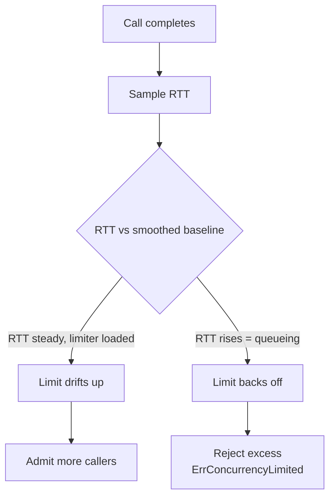

*[Lire en Français](README.fr.md)*

# Example 21 — Adaptive Concurrency

Demonstrates an adaptive concurrency limiter that tunes its own ceiling from
observed latency, using Netflix's Gradient2 algorithm — so you never have to
guess a fixed bulkhead size.

## What it demonstrates

A policy is configured with `WithAdaptiveConcurrency(InitialLimit(10),
MinLimit(2), MaxLimit(50))`. Every completed call samples its round-trip time;
when the current RTT rises above a smoothed long-term baseline — the signature
of queueing downstream — the limit is lowered, and when latency is steady the
limit drifts back up. Calls arriving while in-flight is already at the limit are
rejected with `ErrConcurrencyLimited`.

The example drives the limiter with a simulated downstream whose latency it
changes at runtime:

1. **Healthy load.** With a fast 5ms downstream and 40 callers hammering a limit
   that starts at 10, latency stays stable and demand stays high, so Gradient2
   drifts the limit *upward* toward `MaxLimit` to admit more work. Sustained
   over-subscription matters here: the limit only grows while the limiter is
   actually loaded, so a trickle would never push it to probe higher.
2. **Overload.** Latency is flipped from 5ms to 100ms — a 20x jump that looks
   exactly like the downstream starting to queue. The current RTT shoots above
   the baseline, Gradient2 reads congestion and pulls the limit back *down*,
   which sheds the surplus callers (counted via `OnConcurrencyRejected`). The
   final metrics show the lowered limit, the shed count, and a degraded
   `concurrency_limited` health state.

## How it works



## Key concepts

| Concept | Detail |
|---|---|
| `WithAdaptiveConcurrency(...)` | Replaces a fixed bulkhead ceiling with a limit tuned from observed latency (Gradient2) |
| `InitialLimit` / `MinLimit` / `MaxLimit` | Starting point and the hard rails the tuned limit may never cross |
| Loaded-to-grow | The limit only rises while in-flight is at/above half the limit, so a quiet service is never pushed to probe higher |
| `ErrConcurrencyLimited` | Returned to callers shed at the limit — expected under overload, not a downstream failure |
| `OnConcurrencyRejected` / `OnConcurrencyLimitChanged` | Hooks for sheds and for each limit adjustment |
| `ConcurrencyLimit` / `ConcurrencyInFlight` | Gauges for the current limit and live in-flight count; saturation surfaces as a degraded `concurrency_limited` health condition |

## When to use

- A downstream whose safe concurrency you can't pin down — it varies with load,
  deploys, or noisy neighbours — so a hand-tuned bulkhead is always wrong.
- To protect a dependency from overload *automatically*: the limit follows
  latency down before the dependency falls over.
- Mutually exclusive with `WithBulkhead` — they occupy the same chain slot, and
  configuring both panics `NewPolicy` with `ErrConcurrencyLimiterConflict`. Pick
  the fixed ceiling when you know the right number, the adaptive one when you
  don't.

## Run

```bash
go run ./examples/21-adaptive-concurrency/
```

## Expected output

A starting limit of 10, a higher limit after the healthy phase, then a lower
limit after the overload phase along with a non-zero shed count and a degraded
health state. The exact limit values depend on goroutine scheduling and timing,
so the numbers vary run to run — the *direction* (up under health, down under
overload) is the stable, observable behaviour.
