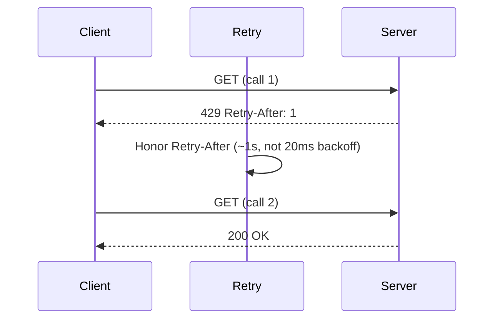

*[Read in English](README.md)*

# Exemple 23 — Respecter Retry-After

Illustre comment l'adaptateur `httpx` respecte un en-tête HTTP `Retry-After` :
lorsqu'un serveur répond `429 Too Many Requests` avec `Retry-After: 1`, le retry
attend la seconde demandée par le serveur au lieu de son propre backoff configuré.

## Ce que cet exemple illustre

Un serveur en limitation de débit sait quand il sera de nouveau prêt. Réessayer
selon votre propre backoff revient soit à le solliciter trop tôt (retry gaspillé),
soit à attendre plus longtemps que nécessaire — respecter l'indication du serveur
vaut mieux que toute estimation.

1. Un serveur fictif répond au **premier** appel par `429 + Retry-After: 1`, puis
   réussit au second.
2. Un classifieur associe `429` à `Transient` (réessayable), les autres `4xx/5xx`
   à `Permanent`, et `2xx` à `Success`.
3. Le client `httpx` est configuré avec un backoff volontairement minuscule de
   **20 ms**. Si `Retry-After` était ignoré, le retry se déclencherait presque
   immédiatement.
4. Comme l'adaptateur expose `Retry-After` sous forme d'erreur
   `RetryAfterProvider`, le retry attend plutôt **~1 s** (±10 % de gigue) — la
   valeur demandée par le serveur.

Le programme affiche le statut final, le nombre d'appels et le temps écoulé afin
de confirmer que l'attente suit l'indication du serveur, et non le backoff local.

## Fonctionnement



## Concepts clés

| Concept | Détail |
|---|---|
| `RetryAfterProvider` | Une erreur exposant `RetryAfter() (time.Duration, bool)` ; le retry la respecte à la place du backoff calculé |
| Adaptateur `httpx` | Expose automatiquement un en-tête `Retry-After` d'un `429`/`503` HTTP (en secondes ou date HTTP) sous forme de `RetryAfterProvider` |
| `httpx.ErrorClass` | Le classifieur associe les codes de statut à `Transient` / `Permanent` / `Success` pour que le retry sache quelles réponses réessayer |
| Gigue ±10 %, plafond `MaxDelay` | Le délai respecté est jitté et plafonné, pour qu'un `Retry-After` hostile ne puisse pas vous bloquer indéfiniment |

## Quand l'utiliser

- Pour dialoguer avec des API en limitation de débit ou en délestage qui envoient
  `Retry-After` sur `429` ou `503` — laissez le serveur dicter l'attente.
- Partout où un downstream connaît mieux sa propre disponibilité que ne le
  devinerait un backoff fixe.
- Hors HTTP, attachez une indication à n'importe quelle erreur avec
  `r8e.RetryAfterError(err, d)` ou implémentez vous-même `RetryAfterProvider`.

## Exécution

```bash
go run ./examples/23-retry-after/
```

## Sortie attendue

Un `200` après **2** appels, avec un temps écoulé autour de **1000 ms** — le
`Retry-After: 1` du serveur, pas le backoff de 20 ms. La durée exacte varie
légèrement selon la gigue et l'ordonnancement.
