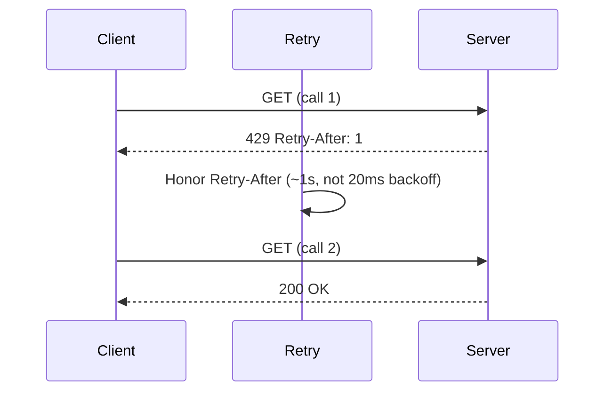

*[Lire en Français](README.fr.md)*

# Example 23 — Honoring Retry-After

Demonstrates how the `httpx` adapter honors an HTTP `Retry-After` header: when a
server replies `429 Too Many Requests` with `Retry-After: 1`, the retry waits the
second the server asked for instead of its own configured backoff.

## What it demonstrates

A rate-limited server knows when it will be ready again. Retrying on your own
backoff either hammers it too early (wasting the retry) or waits longer than
necessary — honoring the server's hint beats anything you'd guess.

1. A stub server answers the **first** call with `429 + Retry-After: 1`, then
   succeeds on the second.
2. A classifier maps `429` to `Transient` (retriable), other `4xx/5xx` to
   `Permanent`, and `2xx` to `Success`.
3. The `httpx` client is configured with a deliberately tiny **20ms** backoff. If
   `Retry-After` were ignored, the retry would fire almost immediately.
4. Because the adapter surfaces `Retry-After` as a `RetryAfterProvider` error,
   retry instead waits **~1s** (±10% jitter) — the value the server asked for.

The program prints the final status, the number of calls, and the elapsed time so
you can confirm the wait tracks the server's hint, not the local backoff.

## How it works



## Key concepts

| Concept | Detail |
|---|---|
| `RetryAfterProvider` | An error exposing `RetryAfter() (time.Duration, bool)`; retry honors it in place of the computed backoff |
| `httpx` adapter | Surfaces an HTTP `429`/`503` `Retry-After` header (delay-seconds or HTTP-date) as a `RetryAfterProvider` automatically |
| `httpx.ErrorClass` | The classifier maps status codes to `Transient` / `Permanent` / `Success` so retry knows which responses to retry |
| ±10% jitter, `MaxDelay` cap | The honored delay is jittered and capped, so a hostile `Retry-After` can't pin you indefinitely |

## When to use

- Talking to rate-limited or load-shedding APIs that send `Retry-After` on `429`
  or `503` — let the server dictate the wait.
- Anywhere a downstream knows its own readiness better than your fixed backoff
  would guess.
- Outside HTTP, attach a hint to any error with `r8e.RetryAfterError(err, d)` or
  implement `RetryAfterProvider` yourself.

## Run

```bash
go run ./examples/23-retry-after/
```

## Expected output

A `200` after **2** calls, with the elapsed time around **1000ms** — the server's
`Retry-After: 1`, not the 20ms backoff. Exact timing varies slightly with jitter
and scheduling.
