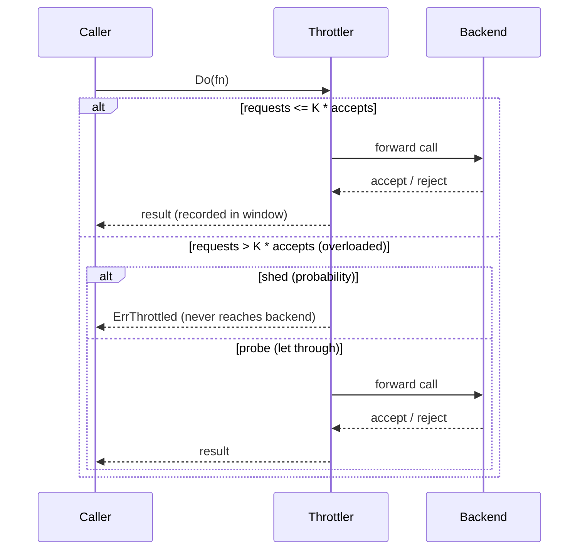

*[Read in English](README.md)*

# Exemple 25 — Throttling adaptatif

Illustre le throttling adaptatif côté client de Google-SRE : un délesteur de
charge probabiliste qui rejette les appels localement — avant qu'ils n'atteignent
un backend en difficulté — proportionnellement à la fraction d'appels que ce
backend rejette déjà. Lorsque le backend se rétablit, le délestage se résorbe de
lui-même.

## Ce que cet exemple illustre

Une politique est configurée avec `WithAdaptiveThrottle(...)`. Le throttler tient
une fenêtre glissante des requêtes *tentées* face aux requêtes *acceptées* par le
backend. Dès que les requêtes dépassent `OverloadRatio` (K) fois les acceptations,
il délestte les nouveaux appels avec la probabilité SRE
`max(0, (requêtes − K·acceptations) / (requêtes + 1))`. Un appel délestté renvoie
immédiatement `ErrThrottled`, sans jamais exécuter l'étage interne.

L'exemple fait passer un backend simulé par trois phases :

1. **Sain** — chaque appel réussit, donc les requêtes suivent les acceptations,
   l'écart ne franchit jamais K, et rien n'est délestté.
2. **Surchargé** — le backend rejette tout. L'écart requêtes/acceptations se
   creuse et le throttler délestte une fraction croissante des appels localement,
   plafonnée par `MaxRejectionRate` (0,9) pour qu'une part du trafic sonde
   toujours le backend.
3. **Rétabli** — le backend est sain de nouveau ; une fois les échecs sortis de
   la fenêtre, la probabilité de rejet retombe à zéro sans réinitialisation
   explicite.

## Fonctionnement



## Concepts clés

| Concept | Détail |
|---|---|
| `WithAdaptiveThrottle(...)` | Active un délestage de charge proportionnel, côté client, juste à l'extérieur du breaker |
| `OverloadRatio(K)` | Délestte dès que les requêtes tentées dépassent K fois les acceptées |
| `MinRequests(n)` | Plancher de trafic avant que le délestage puisse s'enclencher |
| `ThrottleWindow(d)` | Longueur de la fenêtre glissante ; les échecs sortent après `d` |
| `MaxRejectionRate(r)` | Plafond de la probabilité de rejet pour qu'une part du trafic sonde toujours |
| `OnThrottled` | Hook déclenché pour chaque appel délestté localement |
| `ErrThrottled` | Renvoyé par un appel délestté ; la chaîne interne (et le backend) ne s'exécutent pas |

## Quand l'utiliser

- Protéger un backend partagé d'un afflux massif quand il commence à défaillir —
  en délestant graduellement et proportionnellement plutôt qu'avec un breaker
  binaire.
- Ramener en douceur un backend qui se rétablit vers la santé, idéalement avant
  même que le circuit breaker ne s'ouvre.
- Tout client où forwarder des requêtes vouées à l'échec gaspille autant les
  ressources de l'appelant (goroutines, connexions, timeouts) que celles du
  backend.

## Exécution

```bash
go run ./examples/25-adaptive-throttle/
```

## Sortie attendue

Trois phases. Les phases saine et rétablie forwardent chaque appel avec une
probabilité de rejet de `0.00` et ne délesttent rien ; la phase surchargée ne
forwarde qu'une petite fraction de sondage, délestte le reste, et rapporte une
probabilité de rejet proche de `0.90` avec l'état de santé `throttling`. Les
comptes exacts forwardés/délesttés varient légèrement d'une exécution à l'autre
car le délestage est probabiliste.
