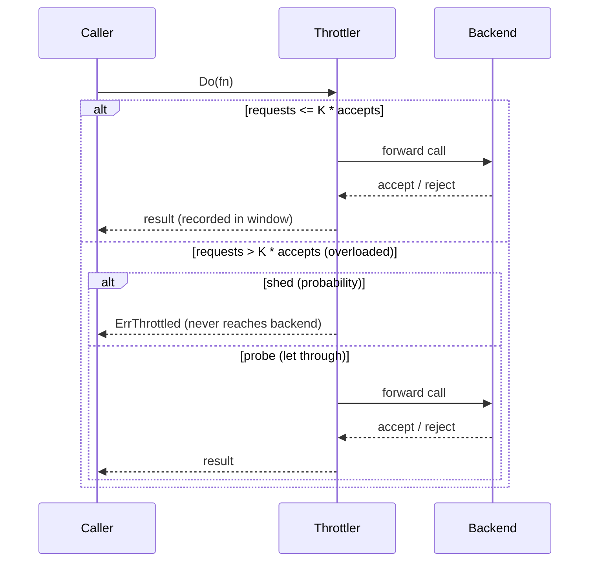

*[Lire en Français](README.fr.md)*

# Example 25 — Adaptive Throttle

Demonstrates Google-SRE client-side adaptive throttling: a probabilistic load
shedder that rejects calls locally — before they reach a struggling backend — in
proportion to how heavily that backend is already rejecting them. When the
backend recovers, shedding clears on its own.

## What it demonstrates

A policy is configured with `WithAdaptiveThrottle(...)`. The throttler keeps a
sliding window of requests *attempted* versus requests the backend *accepted*.
Once requests exceed `OverloadRatio` (K) times accepts, it sheds new calls with
the SRE probability `max(0, (requests − K·accepts) / (requests + 1))`. A shed
call returns `ErrThrottled` immediately, without ever running the inner stage.

The example drives a simulated backend through three phases:

1. **Healthy** — every call succeeds, so requests track accepts, the gap never
   crosses K, and nothing is shed.
2. **Overloaded** — the backend rejects everything. The request/accept gap
   widens and the throttler sheds a growing fraction of calls locally, capped at
   `MaxRejectionRate` (0.9) so a sliver of traffic always probes.
3. **Recovered** — the backend is healthy again; once the failures age out of
   the window the reject probability falls back to zero with no explicit reset.

## How it works



## Key concepts

| Concept | Detail |
|---|---|
| `WithAdaptiveThrottle(...)` | Enables proportional, client-side load shedding just outside the breaker |
| `OverloadRatio(K)` | Shed once attempted requests exceed K times the accepted ones |
| `MinRequests(n)` | Floor of traffic before shedding can engage at all |
| `ThrottleWindow(d)` | Sliding window length; failures age out after `d` |
| `MaxRejectionRate(r)` | Cap on the reject probability so some traffic always probes |
| `OnThrottled` | Hook fired for each locally-shed call |
| `ErrThrottled` | Returned by a shed call; the inner chain (and backend) never run |

## When to use

- Protecting a shared backend from a thundering herd when it starts to fail —
  shedding gradually and proportionally rather than via a binary breaker.
- Easing a recovering backend back to health, ideally before the circuit breaker
  ever opens.
- Any client where forwarding doomed requests wastes the caller's own resources
  (goroutines, connections, timeouts) as much as the backend's.

## Run

```bash
go run ./examples/25-adaptive-throttle/
```

## Expected output

Three phases. The healthy and recovered phases forward every call with a reject
probability of `0.00` and shed nothing; the overloaded phase forwards only a
small probe fraction, sheds the rest, and reports a reject probability near
`0.90` with health state `throttling`. The exact forwarded/shed counts vary
slightly from run to run because shedding is probabilistic.
