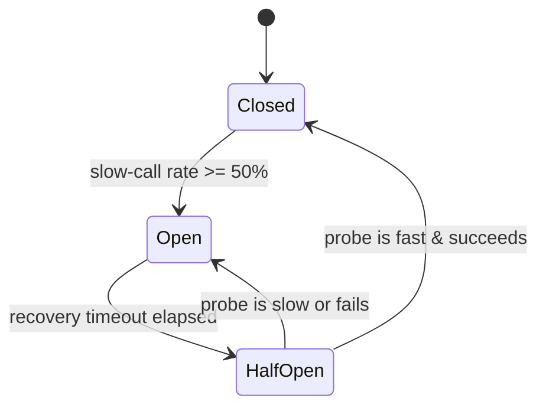

*[Read in English](README.md)*

# Exemple 26 — Circuit breaker sur appels lents

Illustre un circuit breaker qui s'ouvre sur le **taux d'appels lents**, et pas
seulement sur les échecs. Un backend en « brownout » répond à chaque requête mais
y répond lentement — aucune erreur, juste une latence qui s'installe — ce qu'un
breaker basé uniquement sur les échecs ne remarquerait jamais.

## Ce que cet exemple illustre

Le breaker est configuré avec `SlowCallRate(50ms, 0.5)` : un appel plus lent que
**50 ms** est « lent », et le breaker s'ouvre dès que **50 %** des appels de la
fenêtre récente sont lents. Le seuil d'échec est volontairement fixé très haut
pour ne jamais se déclencher — toute ouverture observée vient donc forcément du
détecteur d'appels lents.

L'exemple fait passer le backend simulé par trois phases :

1. **Rapide** — chaque appel bat le seuil de 50 ms ; la fraction lente reste à
   zéro et le breaker reste fermé.
2. **Brownout** — le backend reste *en succès* mais dort 100 ms par appel. Les
   appels lents successifs poussent la fraction lente au-delà de 50 %, le breaker
   **s'ouvre** (signalé par `OnCircuitOpen` et `OnSlowCallRateExceeded`), et les
   appels suivants échouent vite avec `ErrCircuitOpen` au lieu de rester suspendus
   sur le backend lent.
3. **Rétablissement** — après le délai de récupération le breaker passe en
   **half-open** ; l'appel rapide suivant est la sonde qui, réussissant
   rapidement, le **referme**.

L'ouverture sur appels lents s'ajoute à celle sur échecs : le breaker s'ouvre sur
le premier des deux symptômes qui se déclenche.

## Fonctionnement



## Concepts clés

| Concept | Détail |
|---|---|
| `SlowCallRate(d, r)` | Un appel plus lent que `d` est « lent » ; ouvre dès que cette fraction atteint `r` |
| `SlowCallWindow(n)` | Fenêtre par décompte sur laquelle la fraction lente est mesurée |
| `SlowCallMinCalls(n)` | Nombre minimal d'appels avant que le taux d'appels lents puisse ouvrir |
| `FailureThreshold(n)` | Fixé haut ici pour que seul le taux d'appels lents ouvre le breaker |
| `RecoveryTimeout(d)` | Durée pendant laquelle le breaker reste ouvert avant d'autoriser une sonde half-open |
| `OnSlowCallRateExceeded` | Hook qui attribue l'ouverture aux appels lents, non aux échecs |
| `ErrCircuitOpen` | Renvoyé tant que le breaker est ouvert ; l'appel échoue vite sans toucher le backend |

## Quand l'utiliser

- Backends qui se dégradent en devenant lents plutôt qu'en échouant — pannes
  grises, pauses GC, pools de threads saturés, bases de données surchargées.
- Toute dépendance où une réponse réussie-mais-lente nuit quand même à l'appelant
  (goroutines bloquées, timeouts épuisés) et devrait délester la charge.
- En complément de l'ouverture sur échecs, pour une défense en profondeur :
  ouvrir sur le premier symptôme — erreurs ou latence — qui apparaît.

## Exécution

```bash
go run ./examples/26-slow-call-breaker/
```

## Sortie attendue

La phase 1 rapporte quatre appels rapides avec un taux d'appels lents de `0%`. La
phase 2 montre le taux lent qui grimpe (25 %, 50 %), le breaker qui s'ouvre via
les hooks, et les appels suivants rejetés avec « circuit is open ». La phase 3
montre les transitions half-open puis closed et un dernier appel réussi. Les
détails dépendant du temps peuvent varier légèrement d'une exécution à l'autre.
