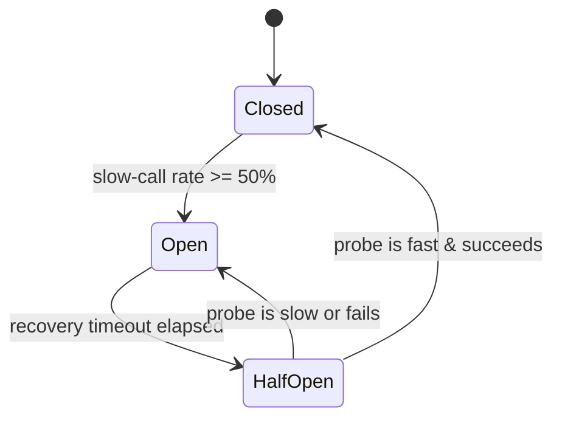

*[Lire en Français](README.fr.md)*

# Example 26 — Slow-Call Circuit Breaker

Demonstrates a circuit breaker that trips on the **slow-call rate**, not just on
failures. A backend in a "brownout" answers every request but answers slowly — no
errors, just creeping latency — which a failure-only breaker would never notice.

## What it demonstrates

The breaker is configured with `SlowCallRate(50ms, 0.5)`: a call slower than
**50ms** is "slow", and the breaker opens once **50%** of the calls in the recent
window are slow. The failure threshold is set deliberately high so it can never
trip — any open we observe must come from the slow-call detector.

The example drives the simulated backend through three phases:

1. **Fast** — every call beats the 50ms threshold; the slow fraction stays at
   zero and the breaker stays closed.
2. **Brownout** — the backend stays *successful* but sleeps 100ms per call.
   Successive slow calls push the slow fraction over 50%, the breaker **opens**
   (signalled by `OnCircuitOpen` and `OnSlowCallRateExceeded`), and later calls
   fast-fail with `ErrCircuitOpen` instead of hanging on the slow backend.
3. **Recovery** — after the recovery timeout the breaker goes **half-open**; the
   next fast call is the probe that, succeeding quickly, **closes** it again.

The slow-call trip is additive to the failure trip: the breaker opens on
whichever fires first.

## How it works



## Key concepts

| Concept | Detail |
|---|---|
| `SlowCallRate(d, r)` | A call slower than `d` is "slow"; open once that fraction reaches `r` |
| `SlowCallWindow(n)` | Count-based window over which the slow fraction is measured |
| `SlowCallMinCalls(n)` | Minimum calls before the slow-call rate can trip |
| `FailureThreshold(n)` | Set high here so only the slow-call rate can open the breaker |
| `RecoveryTimeout(d)` | How long the breaker stays open before allowing a half-open probe |
| `OnSlowCallRateExceeded` | Hook that attributes the open to slow calls, not failures |
| `ErrCircuitOpen` | Returned while open; the call fast-fails without touching the backend |

## When to use

- Backends that degrade by getting slow rather than by erroring — gray failures,
  GC pauses, saturated thread pools, overloaded databases.
- Any dependency where a successful-but-slow response still hurts the caller
  (tied-up goroutines, exhausted timeouts) and should shed load.
- Alongside the failure-based trip for defence in depth: open on whichever
  symptom — errors or latency — appears first.

## Run

```bash
go run ./examples/26-slow-call-breaker/
```

## Expected output

Phase 1 reports four fast calls with a slow-call rate of `0%`. Phase 2 shows the
slow rate climbing (25%, 50%), the breaker opening via the hooks, and subsequent
calls rejected with "circuit is open". Phase 3 shows the half-open and closed
transitions and a final successful call. Timing-dependent details may shift
slightly between runs.
