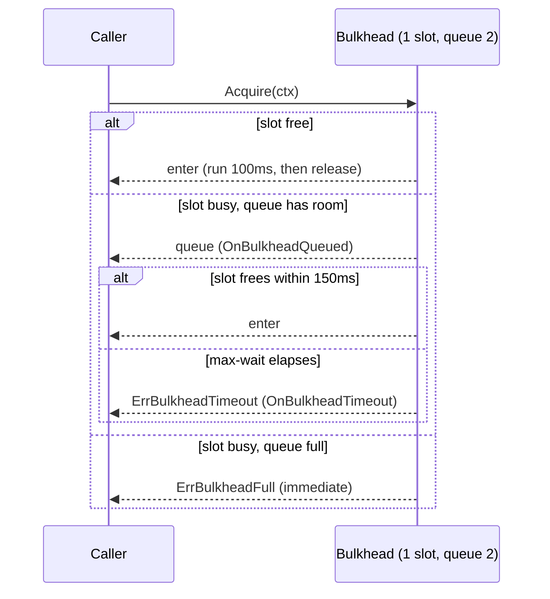

*[Read in English](README.md)*

# Exemple 27 — Bulkhead avec attente bornée

Illustre un bulkhead avec une **attente FIFO bornée**. Contrairement au bulkhead
simple (exemple 06), qui rejette immédiatement dès qu'il est plein, celui-ci
laisse une courte rafale patienter pendant un temps borné — absorbant un pic
survivable au lieu de le transformer en mur d'erreurs.

## Ce que cet exemple illustre

La politique utilise
`WithBulkhead(1, BulkheadMaxWait(150ms), BulkheadQueueDepth(2))` : **1** créneau
concurrent, une file qui contient au plus **2** waiters, et un plafond de
**150 ms** sur le temps d'attente de chaque appelant. Cinq appelants arrivent à
15 ms d'intervalle et chaque créneau occupé dure 100 ms, ce qui fait apparaître
les trois issues :

1. **Servi immédiatement ou après une courte attente** — un appelant qui acquiert
   le créneau dans son max-wait s'exécute et réussit.
2. **Expiré** (`ErrBulkheadTimeout`) — un appelant en file dont les 150 ms
   s'écoulent avant qu'un créneau ne se libère abandonne. C'est distinct d'un
   rejet immédiat.
3. **Rejeté** (`ErrBulkheadFull`) — un appelant qui arrive alors que la file
   bornée est déjà pleine (1 en cours + 2 en attente) est rejeté aussitôt, sans
   attendre.

Un appelant dont le contexte est annulé pendant qu'il attend renverrait à la
place l'erreur du contexte.

## Fonctionnement



## Concepts clés

| Concept | Détail |
|---|---|
| `WithBulkhead(n, ...)` | Limite la concurrence à `n` créneaux |
| `BulkheadMaxWait(d)` | Met en file un bulkhead plein jusqu'à `d` au lieu de rejeter d'emblée |
| `BulkheadQueueDepth(n)` | Borne la file FIFO ; une fois pleine, les nouveaux arrivants sont rejetés immédiatement |
| `ErrBulkheadTimeout` | Un appelant en file a attendu tout le max-wait et a abandonné |
| `ErrBulkheadFull` | Un appelant est arrivé alors que la file était pleine — rejeté sans attendre |
| `OnBulkheadQueued` / `OnBulkheadTimeout` | Hooks pour l'entrée en file et pour l'abandon après le max-wait |

## Quand l'utiliser

- Lisser une charge courte et en rafale face à une ressource étroitement bornée
  (un pool de connexions, un service mono-thread) où une brève mise en file vaut
  mieux qu'un rejet instantané.
- Charges de travail avec un budget de latence significatif : les appelants
  peuvent se permettre d'attendre un peu, mais pas indéfiniment.
- Partout où il faut de la back-pressure avec un plafond clair — borne sur la
  profondeur de file plus borne sur le temps d'attente garantissent que ni la
  mémoire ni la latence ne s'emballent.

## Exécution

```bash
go run ./examples/27-bulkhead-wait/
```

## Sortie attendue

Deux appelants sont servis, deux sont rejetés avec « queue full » et un expire en
attente — avec les lignes `[hook]` marquant chaque entrée en file et chaque
abandon. Comme les cinq appelants s'exécutent en concurrence, l'ordre exact et le
worker qui aboutit à chaque issue peuvent varier légèrement d'une exécution à
l'autre ; les comptes (servis / expirés / rejetés) restent constants.
