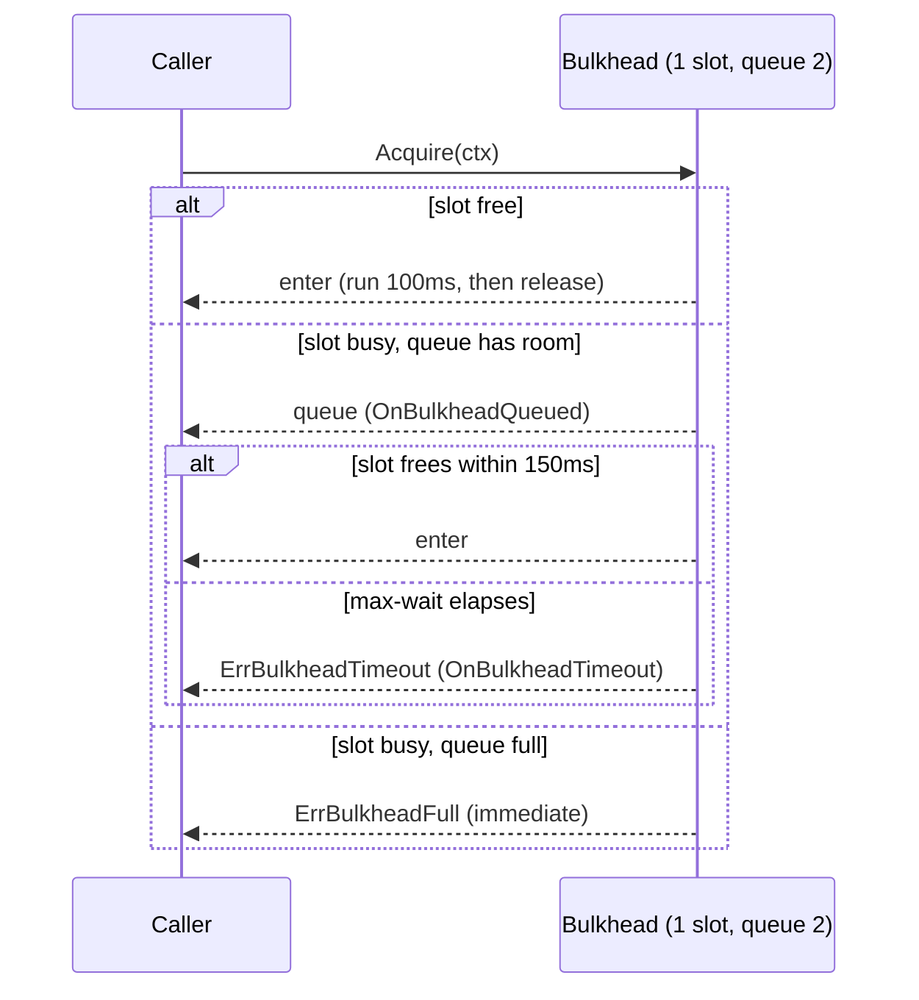

*[Lire en Français](README.fr.md)*

# Example 27 — Bulkhead Bounded Wait

Demonstrates a bulkhead with a **bounded FIFO wait**. Unlike the plain bulkhead
(example 06), which rejects immediately the moment it is full, this one lets a
short burst queue for a bounded time — absorbing a survivable spike instead of
turning it into a wall of errors.

## What it demonstrates

The policy uses `WithBulkhead(1, BulkheadMaxWait(150ms), BulkheadQueueDepth(2))`:
**1** concurrent slot, a queue that holds at most **2** waiters, and a **150ms**
ceiling on how long any caller will wait. Five callers arrive 15ms apart and
each held slot runs for 100ms, which surfaces all three outcomes:

1. **Served immediately or after a short wait** — a caller that acquires the slot
   within its max-wait runs and succeeds.
2. **Timed out** (`ErrBulkheadTimeout`) — a queued caller whose 150ms elapses
   before a slot frees gives up. This is distinct from an immediate rejection.
3. **Rejected** (`ErrBulkheadFull`) — a caller arriving once the bounded queue is
   already full (1 running + 2 queued) is rejected at once, without waiting.

A caller whose context is cancelled while queued would instead return the context
error.

## How it works



## Key concepts

| Concept | Detail |
|---|---|
| `WithBulkhead(n, ...)` | Limit concurrency to `n` slots |
| `BulkheadMaxWait(d)` | Queue a full bulkhead for up to `d` instead of rejecting outright |
| `BulkheadQueueDepth(n)` | Bound the FIFO queue; once full, new arrivals are rejected immediately |
| `ErrBulkheadTimeout` | A queued caller waited the full max-wait and gave up |
| `ErrBulkheadFull` | A caller arrived once the queue was full — rejected without waiting |
| `OnBulkheadQueued` / `OnBulkheadTimeout` | Hooks for entering the queue and for giving up after max-wait |

## When to use

- Smoothing short, bursty load against a tightly bounded resource (a connection
  pool, a single-threaded service) where a brief queue beats instant rejection.
- Workloads with a meaningful latency budget: callers can afford to wait a little,
  but not unboundedly.
- Anywhere you need back-pressure with a clear ceiling — bounded queue depth plus
  bounded wait time guarantees neither memory nor latency runs away.

## Run

```bash
go run ./examples/27-bulkhead-wait/
```

## Expected output

Two callers are served, two are rejected with "queue full", and one times out
waiting — with `[hook]` lines marking each queue entry and each give-up. Because
the five callers run concurrently, the exact ordering and which worker lands in
each outcome can vary slightly between runs; the counts (served / timed out /
rejected) stay consistent.
