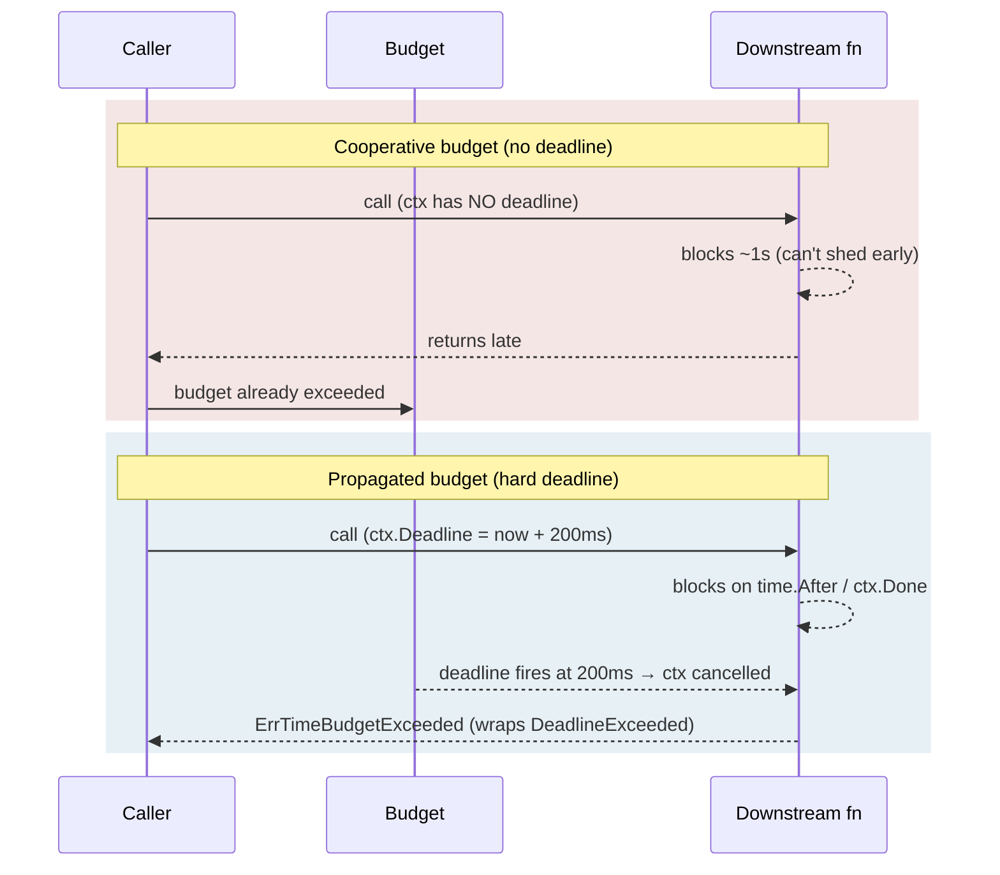

*[Read in English](README.md)*

# Exemple 28 — Propagation de délai stricte

Illustre la différence entre un budget de temps **coopératif** et un budget
**strict et propagé** — et pourquoi un appelé en aval a besoin d'un véritable
`ctx.Deadline()` pour se délester tôt au lieu de s'exécuter jusqu'au bout.

## Ce que cet exemple illustre

Un budget de temps borne le temps total qu'une politique peut dépenser sur
l'ensemble de ses tentatives. Par défaut ce budget est **coopératif** : il
n'arrête la politique qu'*entre* les tentatives et ne définit jamais
`ctx.Deadline()`, de sorte qu'une tentative déjà bloquée dans un backend lent ne
peut pas être interrompue. L'exemple oppose deux exécutions sous le même budget
de 200 ms :

1. **Budget coopératif** — l'appel lent ne voit **aucun délai**. Le budget ne
   peut pas annuler la tentative en cours, qui s'exécute donc jusqu'au bout
   (~1 s) avant même que le budget ait de l'importance. Le temps total dépasse
   largement 200 ms.
2. **Budget propagé** (`PropagateDeadline()`) — chaque tentative s'exécute sous
   un contexte dont le `Deadline()` indique l'instant du budget. L'appel en aval
   l'observe et est **annulé à 200 ms**, renvoyant `ErrTimeBudgetExceeded`.

Enfin, l'exemple montre la chaîne d'erreurs : l'arrêt propagé fait remonter
`ErrTimeBudgetExceeded` **enveloppant** le `context.DeadlineExceeded`
sous-jacent, si bien que `errors.Is` reconnaît les deux.

## Fonctionnement



## Concepts clés

| Concept | Détail |
|---|---|
| `WithTimeBudget(d)` | Borne le temps total sur l'ensemble des tentatives ; coopératif par défaut — laisse `ctx.Deadline()` non défini |
| `PropagateDeadline()` | Expose en plus le budget comme un véritable `ctx.Deadline()` piloté par l'horloge, que les appelés en aval observent et qui annule en cours d'exécution |
| `ErrTimeBudgetExceeded` | Renvoyé lorsque le budget est épuisé ; avec la propagation, il enveloppe `context.DeadlineExceeded` |
| Délai piloté par l'horloge | Le délai est piloté par le `Clock` de la politique, il reste donc déterministe sous une horloge de test factice |

## Quand l'utiliser

- Les appels qui se diffusent vers des backends gRPC/HTTP capables de lire
  `ctx.Deadline()` et de calculer leur propre délai réseau — ce qui leur permet
  de se délester tôt au lieu d'effectuer un travail qui sera jeté.
- Tout chemin où une seule tentative peut se bloquer indéfiniment dans un backend
  en aval et où vous avez besoin que le budget l'annule réellement, pas
  seulement qu'il empêche la prochaine reprise.
- Préférez le budget coopératif par défaut lorsque le travail est purement local
  et en cours de processus, où un délai de contexte strict n'apporte rien.

## Exécution

```bash
go run ./examples/28-deadline-propagation/
```

## Sortie attendue

Deux exécutions étiquetées. L'exécution coopérative indique que la fonction ne
voit **aucun délai** et se termine en environ 1000 ms ; l'exécution propagée
indique un délai d'environ 200 ms et se termine près de 200 ms avec
`ErrTimeBudgetExceeded`. Le bloc final affiche
`errors.Is(err, ErrTimeBudgetExceeded) = true` et
`errors.Is(err, context.DeadlineExceeded) = true`. Les chiffres exacts en
millisecondes varient légèrement selon l'ordonnancement.
