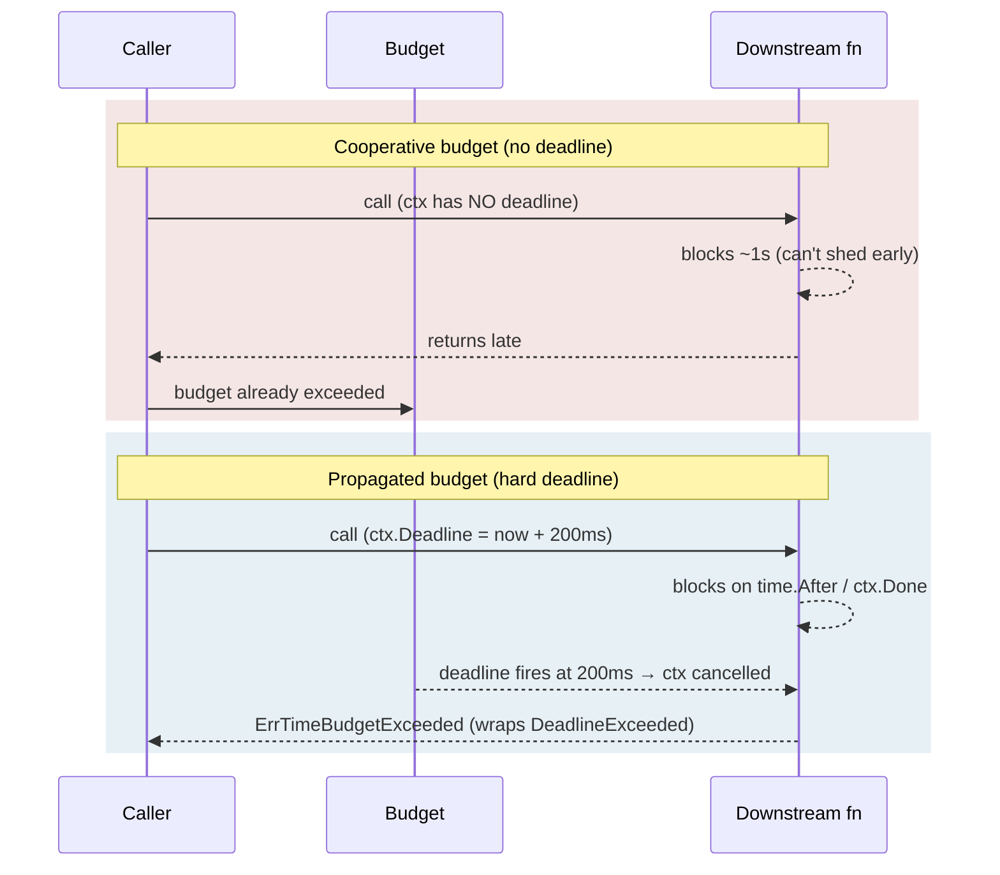

*[Lire en Français](README.fr.md)*

# Example 28 — Hard Deadline Propagation

Demonstrates the difference between a **cooperative** time budget and a **hard,
propagated** one — and why a downstream callee needs a real `ctx.Deadline()` to
shed early instead of running to completion.

## What it demonstrates

A time budget bounds the total time a policy may spend across all its attempts.
By default that budget is **cooperative**: it only stops the policy *between*
attempts and never sets `ctx.Deadline()`, so an attempt already stuck inside a
slow backend cannot be interrupted. The example contrasts two runs over the same
200ms budget:

1. **Cooperative budget** — the slow call sees **no deadline**. The budget can't
   cancel the in-flight attempt, so it runs to completion (~1s) before the
   budget even matters. The total time blows past 200ms.
2. **Propagated budget** (`PropagateDeadline()`) — each attempt runs under a
   context whose `Deadline()` reports the budget instant. The downstream call
   observes it and is **cancelled at 200ms**, returning
   `ErrTimeBudgetExceeded`.

Finally, the example shows the error chain: the propagated stop surfaces
`ErrTimeBudgetExceeded` **wrapping** the underlying `context.DeadlineExceeded`,
so `errors.Is` matches both.

## How it works



## Key concepts

| Concept | Detail |
|---|---|
| `WithTimeBudget(d)` | Bounds total time across attempts; cooperative by default — leaves `ctx.Deadline()` unset |
| `PropagateDeadline()` | Also exposes the budget as a real, clock-driven `ctx.Deadline()` that downstream callees observe and that cancels in flight |
| `ErrTimeBudgetExceeded` | Returned when the budget runs out; with propagation it wraps `context.DeadlineExceeded` |
| Clock-driven deadline | The deadline is driven by the policy's `Clock`, so it stays deterministic under a fake test clock |

## When to use

- Calls that fan out to gRPC/HTTP backends which can read `ctx.Deadline()` and
  compute their own wire timeout — letting them shed early instead of doing work
  that will be thrown away.
- Any path where a single attempt can block indefinitely inside a downstream and
  you need the budget to actually cancel it, not just stop the next retry.
- Prefer the default cooperative budget when the work is purely local and
  in-process, where a hard context deadline buys you nothing.

## Run

```bash
go run ./examples/28-deadline-propagation/
```

## Expected output

Two labelled runs. The cooperative run reports the function sees **no deadline**
and finishes in roughly 1000ms; the propagated run reports a deadline ~200ms out
and finishes near 200ms with `ErrTimeBudgetExceeded`. The final block prints
`errors.Is(err, ErrTimeBudgetExceeded) = true` and
`errors.Is(err, context.DeadlineExceeded) = true`. Exact millisecond figures
vary slightly with scheduling.
