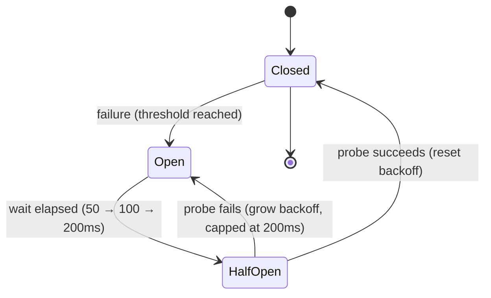

*[Read in English](README.md)*

# Exemple 30 — Recul adaptatif de récupération

Illustre le recul adaptatif de récupération du disjoncteur : chaque sonde
semi-ouverte qui échoue attend plus longtemps avant la tentative suivante, de
sorte qu'un backend qui reste en panne n'est pas martelé à cadence fixe.

## Ce que cet exemple illustre

Lorsqu'un disjoncteur déclenche, il laisse périodiquement passer une seule
**sonde semi-ouverte** pour vérifier si le backend en aval s'est rétabli. Par
défaut, cette sonde se déclenche tous les `RecoveryTimeout`, quel que soit le
nombre de sondes déjà échouées — ce qui continue de solliciter un backend en
difficulté exactement au mauvais moment. Avec `RecoveryBackoffMultiplier`, chaque
sonde échouée **multiplie** l'attente avant la suivante (ici, elle double) ;
`RecoveryMaxBackoff` plafonne cette croissance, et le recul **se réinitialise**
au délai de base dès que le disjoncteur se referme avec succès.

L'exemple scénarise un backend qui échoue à ses deux premières sondes et réussit
à la troisième, avec `RecoveryTimeout=50ms`, `multiplier=2`, `max=200ms` :

1. Déclencher le disjoncteur depuis l'état fermé (un échec, `FailureThreshold(1)`).
2. Sonde 1 après ~50 ms → échoue → l'attente suivante passe à 100 ms.
3. Sonde 2 après ~100 ms → échoue → l'attente suivante passe à 200 ms (plafond
   atteint).
4. Sonde 3 après ~200 ms → réussit → le disjoncteur se referme, le recul se
   réinitialise.

## Fonctionnement



## Concepts clés

| Concept | Détail |
|---|---|
| `RecoveryTimeout(d)` | Attente de base avant la première sonde semi-ouverte |
| `RecoveryBackoffMultiplier(f)` | Chaque sonde échouée multiplie l'attente par `f` (par ex. 2.0 la double) |
| `RecoveryMaxBackoff(d)` | Plafonne l'attente croissante pour que le disjoncteur re-teste dans un intervalle borné |
| Réinitialisation du recul | Une sonde réussie referme le disjoncteur et réinitialise l'attente à `RecoveryTimeout` |
| `OnCircuitOpen` / `OnCircuitHalfOpen` / `OnCircuitClose` | Hooks qui narrent chaque transition d'état |

## Quand l'utiliser

- Les backends dont les pannes durent de quelques secondes à quelques minutes, où
  un intervalle de sonde rapide et fixe ajouterait une pression de reprise
  significative pendant la fenêtre même où le backend tente de se rétablir.
- Tout disjoncteur où vous voulez que les tentatives de sonde reculent comme un
  client de reprise bien élevé, tout en plafonnant l'attente afin que la
  récupération soit détectée rapidement.

## Exécution

```bash
go run ./examples/30-recovery-backoff/
```

## Sortie attendue

Le disjoncteur déclenche (`OPENED`). Trois tentatives suivent, chacune dormant
un peu au-delà du recul courant (60 ms, 110 ms, 210 ms). Les deux premières
sondes journalisent `fail` et maintiennent le disjoncteur ouvert ; la troisième
journalise `ok`, déclenche `HALF-OPEN` puis `CLOSED`, et renvoie `"pong"`.
L'état du circuit affiché suit les transitions. Les chiffres exacts en
millisecondes varient légèrement selon l'ordonnancement.
