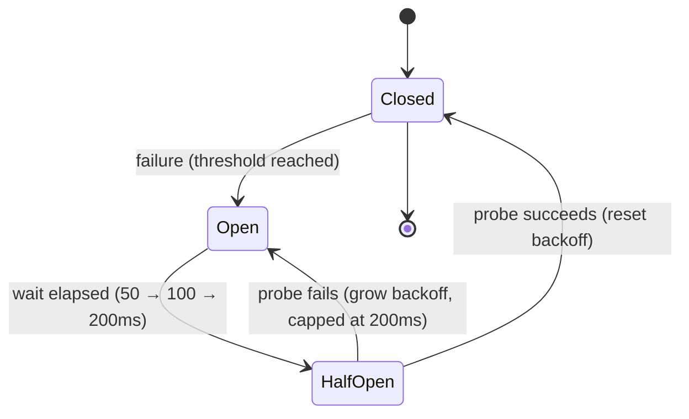

*[Lire en Français](README.fr.md)*

# Example 30 — Adaptive Recovery Backoff

Demonstrates the circuit breaker's adaptive recovery backoff: each failed
half-open probe waits longer before the next attempt, so a downstream that stays
down isn't hammered at a fixed cadence.

## What it demonstrates

When a breaker trips, it periodically allows a single **half-open probe** through
to test whether the downstream has recovered. By default that probe fires every
`RecoveryTimeout`, regardless of how many probes have already failed — which
keeps pressing a struggling backend at exactly the wrong time. With
`RecoveryBackoffMultiplier`, each failed probe **scales** the wait before the
next one (here it doubles); `RecoveryMaxBackoff` caps that growth, and the
backoff **resets** to the base timeout once the breaker successfully closes.

The example scripts a backend that fails its first two probes and succeeds on the
third, with `RecoveryTimeout=50ms`, `multiplier=2`, `max=200ms`:

1. Trip the breaker from closed (one failure, `FailureThreshold(1)`).
2. Probe 1 after ~50ms → fails → next wait grows to 100ms.
3. Probe 2 after ~100ms → fails → next wait grows to 200ms (cap reached).
4. Probe 3 after ~200ms → succeeds → breaker closes, backoff resets.

## How it works



## Key concepts

| Concept | Detail |
|---|---|
| `RecoveryTimeout(d)` | Base wait before the first half-open probe |
| `RecoveryBackoffMultiplier(f)` | Each failed probe multiplies the wait by `f` (e.g. 2.0 doubles it) |
| `RecoveryMaxBackoff(d)` | Caps the growing wait so the breaker still re-checks within a bounded interval |
| Backoff reset | A successful probe closes the breaker and resets the wait to `RecoveryTimeout` |
| `OnCircuitOpen` / `OnCircuitHalfOpen` / `OnCircuitClose` | Hooks that narrate each state transition |

## When to use

- Downstreams whose outages last seconds to minutes, where a fixed fast probe
  interval would add meaningful retry pressure during the very window the backend
  is trying to recover.
- Any breaker where you want probe attempts to back off like a well-behaved
  retrying client, while still capping the wait so recovery is detected promptly.

## Run

```bash
go run ./examples/30-recovery-backoff/
```

## Expected output

The breaker trips (`OPENED`). Three attempts follow, each sleeping a little past
the current backoff (60ms, 110ms, 210ms). The first two probes log `fail` and
keep the breaker open; the third logs `ok`, fires `HALF-OPEN` then `CLOSED`, and
returns `"pong"`. The printed circuit state tracks the transitions. Exact
millisecond figures vary slightly with scheduling.
