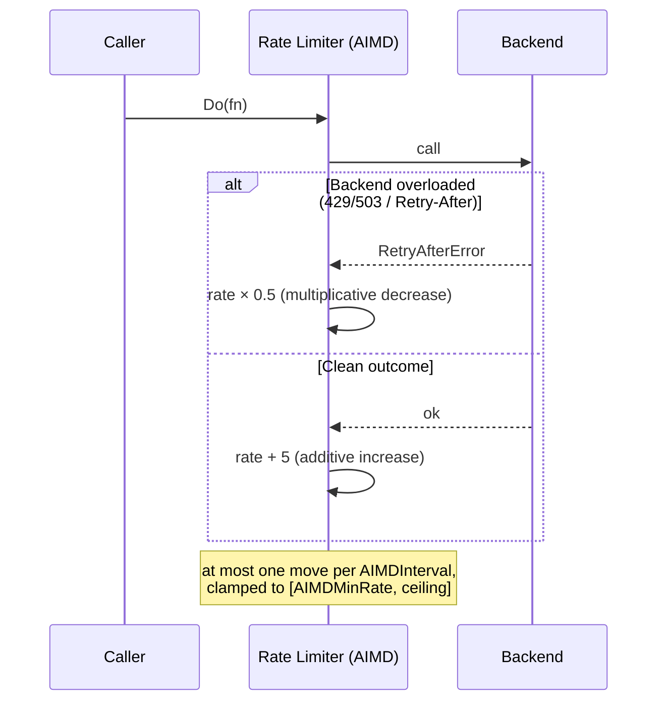

*[Read in English](README.md)*

# Exemple 32 — Limitation de débit adaptative AIMD

Illustre `AIMD(...)`, qui permet au limiteur de débit d'ajuster lui-même son
débit selon la loi **augmentation additive / diminution multiplicative** — la
loi de contrôle de congestion derrière TCP — de sorte qu'un débit fixe devienne
auto-adaptatif : il recule face à un backend en difficulté et récupère une fois
celui-ci rétabli.

## Ce que cet exemple illustre

Un simple `WithRateLimit(rate)` maintient le débit de recharge fixe : trop élevé
et vous inondez un backend surchargé, trop bas et vous bridez un backend sain.
`AIMD` transforme ce nombre unique en un point de départ et un plafond, puis
pilote le débit courant à partir des résultats :

1. **Phase 1 — backend surchargé.** Le backend renvoie une erreur portant un
   `Retry-After` (ce qu'expose un HTTP 429/503). Chaque intervalle AIMD *divise
   par deux* le débit (`AIMDBackoff(0.5)`), faisant chuter `100 → 50 → 25 → …`
   vers le plancher `AIMDMinRate(10)` — une réaction franche pour délester vite.
2. **Phase 2 — backend rétabli.** Les appels propres signalent de la marge.
   Chaque intervalle *ajoute* `AIMDIncrease(5)`, remontant doucement vers le
   plafond de `100/s` — on sonde le débit sûr plutôt que de matraquer le backend
   tout juste rétabli.

Le résultat est la classique dent de scie du contrôle de congestion : chute
brutale en surcharge, remontée lente en récupération.

## Fonctionnement



## Concepts clés

| Concept | Détail |
|---|---|
| `WithRateLimit(100, AIMD(...))` | Le `100` est à la fois le débit de départ et le plafond vers lequel AIMD remonte |
| `AIMDMinRate(10)` | Plancher — ne jamais brider à zéro, pour qu'une sonde puisse détecter la reprise |
| `AIMDBackoff(0.5)` | Multiplie le débit par cette valeur sur un signal de surcharge (réaction franche) |
| `AIMDIncrease(5)` | Réajoute cette valeur par intervalle propre (récupération douce) |
| `AIMDInterval(40ms)` | Au plus un ajustement par intervalle, pour qu'une rafale recule une fois, sans s'effondrer |
| Signal de surcharge | Par défaut `ErrRateLimited` ou un indice `Retry-After` ; redéfinissable via `AIMDClassifier(...)` |
| Hook `OnRateAdapted` / métriques `RateAdaptations`, `RateLimit` | Observent chaque mouvement, le décompte et le débit courant |

## Quand l'utiliser

- Appels vers un backend dont vous ignorez le débit sûr a priori, ou qui varie
  selon sa propre charge — laissez le limiteur le découvrir plutôt que de deviner.
- Backends qui signalent explicitement la surcharge (HTTP 429/503 avec
  `Retry-After`), lorsque vous voulez honorer ce signal automatiquement.
- Partout où vous voulez une dégradation gracieuse sous pression et une
  récupération automatique ensuite, sans qu'un humain reparamètre un débit fixe.

## Exécution

```bash
go run ./examples/32-aimd-rate-limit/
```

## Sortie attendue

La phase 1 journalise la division par deux du débit à chaque adaptation `[aimd]`
et rapporte un débit bien plus bas après recul (proche du plancher de `10/s`). La
phase 2 journalise la remontée additive du débit et rapporte un débit plus élevé
après récupération, ainsi que le nombre total d'adaptations AIMD. Les valeurs
exactes varient légèrement selon le timing, puisque chaque appel doit franchir un
intervalle AIMD pour enregistrer un mouvement.
