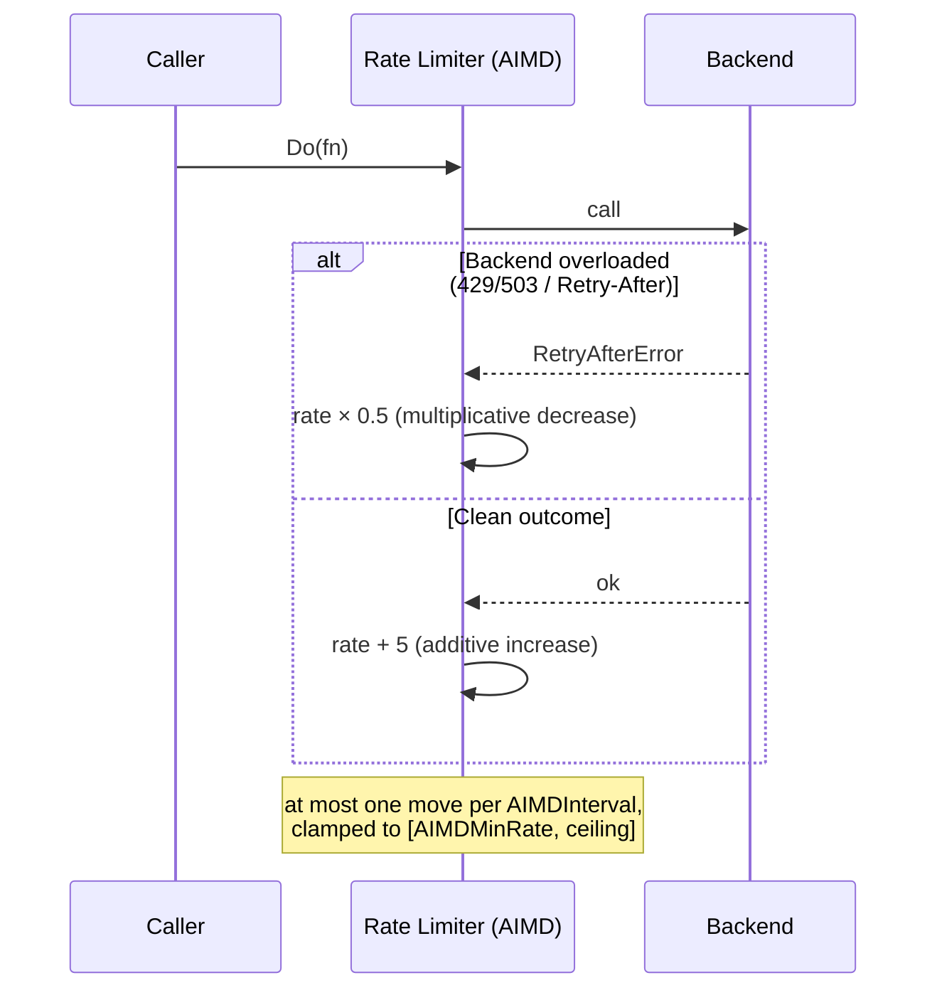

*[Lire en Français](README.fr.md)*

# Example 32 — AIMD Adaptive Rate Limit

Demonstrates `AIMD(...)`, which lets the rate limiter tune its own throughput
using **additive-increase / multiplicative-decrease** — the congestion-control
law behind TCP — so a fixed rate becomes a self-adjusting one that backs off a
struggling backend and recovers once it heals.

## What it demonstrates

A plain `WithRateLimit(rate)` holds the refill rate fixed: too high and you flood
an overloaded backend, too low and you throttle a healthy one. `AIMD` turns that
single number into a starting point and a ceiling, then steers the live rate from
the outcomes:

1. **Phase 1 — backend overloaded.** The backend returns a `Retry-After`-carrying
   error (what an HTTP 429/503 surfaces). Each AIMD interval *halves* the rate
   (`AIMDBackoff(0.5)`), driving `100 → 50 → 25 → …` toward the `AIMDMinRate(10)`
   floor — reacting hard to shed load fast.
2. **Phase 2 — backend recovered.** Clean calls signal headroom. Each interval
   *adds* `AIMDIncrease(5)` back, climbing gently toward the `100/s` ceiling —
   probing for the safe rate rather than slamming the just-healed backend.

The result is the classic congestion-control sawtooth: sharp drop on overload,
slow climb on recovery.

## How it works



## Key concepts

| Concept | Detail |
|---|---|
| `WithRateLimit(100, AIMD(...))` | The `100` is both the starting rate and the ceiling AIMD climbs back toward |
| `AIMDMinRate(10)` | Floor — never throttle to zero, so a probe can still detect recovery |
| `AIMDBackoff(0.5)` | Multiply the rate by this on an overload signal (react hard) |
| `AIMDIncrease(5)` | Add this back per clean interval (recover gently) |
| `AIMDInterval(40ms)` | At most one adjustment per interval, so a burst backs off once, not to collapse |
| Overload signal | By default `ErrRateLimited` or a `Retry-After` hint; override with `AIMDClassifier(...)` |
| `OnRateAdapted` hook / `RateAdaptations`, `RateLimit` metrics | Observe each move, the count, and the live rate |

## When to use

- Calling a backend whose safe throughput you don't know up front, or that
  varies with its own load — let the limiter discover it instead of guessing.
- Backends that signal overload explicitly (HTTP 429/503 with `Retry-After`),
  where you want to honour that signal automatically.
- Anywhere you want graceful degradation under pressure and automatic recovery
  afterward, without a human retuning a static rate.

## Run

```bash
go run ./examples/32-aimd-rate-limit/
```

## Expected output

Phase 1 logs the rate halving on each `[aimd]` adaptation and reports a much
lower rate after backoff (near the `10/s` floor). Phase 2 logs the rate climbing
back additively and reports a higher rate after recovery, plus the total number
of AIMD adaptations. Exact numbers vary slightly with timing, since each call
must cross an AIMD interval to register a move.
