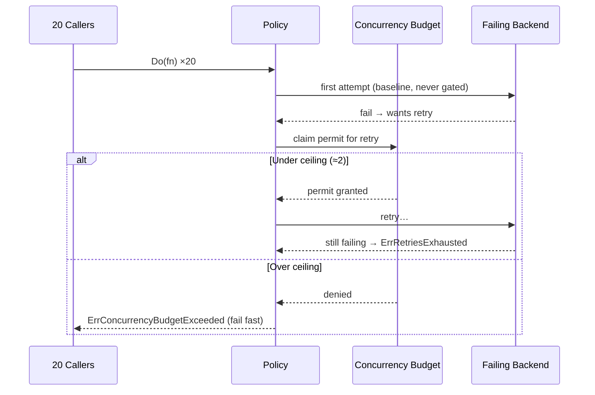

*[Read in English](README.md)*

# Exemple 33 — Budget de concurrence

Illustre `WithConcurrencyBudget`, qui plafonne le nombre de réessais (et de
hedges) pouvant être en vol **simultanément** — sous forme de fraction du trafic
courant assortie d'un plancher — afin qu'une tempête de réessais ne puisse pas
empiler de la charge concurrente sur un backend déjà en échec.

## Ce que cet exemple illustre

Quand une dépendance échoue, chaque appelant réessaie au même instant,
multipliant la charge sur le service précisément déjà en difficulté — la classique
tempête de réessais qui transforme un incident passager en panne. Un budget de
concurrence est le complément, dans la dimension concurrence, du budget de
réessais (qui bride le *débit* de réessais dans le temps) : il n'admet qu'une part
bornée de réessais simultanés et fait échouer le reste rapidement.

L'exemple lance 20 appels concurrents vers un service aval en échec :

1. La **première tentative de chaque appel est la ligne de base** — jamais
   bridée — de sorte que les 20 échouent ensemble et veulent toutes réessayer au
   même instant.
2. Le budget n'autorise un réessai que tant que
   `concurrent < max(MinConcurrency, MaxRatio × en-vol)`. Avec les valeurs
   serrées `MaxRatio(0.1)` / `MinConcurrency(2)` ici, ce plafond vaut ~2 réessais
   simultanés.
3. Les appels au-delà du plafond échouent vite avec
   **`ErrConcurrencyBudgetExceeded`** (charge déviée) ; les appels ayant obtenu un
   permis mais continuant d'échouer épuisent leurs réessais avec
   `ErrRetriesExhausted`. Les deux issues sont comptées séparément.
4. Le délestage est une protection de charge, pas une faute — la politique reste
   **saine et prête**, donc un orchestrateur ne tuera pas une instance qui
   fonctionne en pleine tempête.

## Fonctionnement



## Concepts clés

| Concept | Détail |
|---|---|
| `WithConcurrencyBudget(MaxRatio, MinConcurrency)` | Plafonne les réessais/hedges simultanés ; inerte sans `WithRetry` ou `WithHedge` (sinon panic dans `NewPolicy`) |
| `MaxRatio(0.1)` | Le plafond s'adapte au trafic courant — un service plus chargé tolère plus de réessais simultanés |
| `MinConcurrency(2)` | Plancher pour qu'un service à faible trafic puisse quand même réessayer |
| Première tentative | La ligne de base ; jamais bridée. Seuls les réessais et la tentative de hedge réclament un permis |
| `ErrConcurrencyBudgetExceeded` | Renvoyé quand un réessai est délesté (enveloppe la dernière erreur aval) |
| Hook `OnConcurrencyBudgetExceeded` / métriques `ConcurrencyBudgetExceeded`, `ConcurrencyBudgetInUse` | Observent le délestage et l'usage courant des permis |
| `HealthStatus()` | Reste sain sous délestage — la disponibilité (readiness) n'est pas affectée |

## Quand l'utiliser

- Tout service qui réessaie contre une dépendance partagée, où un échec corrélé
  déclencherait sinon une tempête de réessais synchronisée.
- Pour borner le *parallélisme* des réessais (à utiliser avec le budget de
  réessais pour aussi borner leur débit dans le temps).
- Chemins à fort éventail (fan-out) où de nombreuses goroutines pourraient
  réessayer le même appel en échec simultanément et amplifier la panne.

## Exécution

```bash
go run ./examples/33-concurrency-budget/
```

## Sortie attendue

Une section « tempête » rapporte les 20 appels concurrents, combien de réessais
le budget a délestés, combien d'appels ont épuisé leurs réessais et combien de
fois le hook `OnConcurrencyBudgetExceeded` s'est déclenché. Une section
observabilité affiche le compteur de délestages, les permis en cours
d'utilisation (0 une fois la tempête écoulée) et l'état de santé — montrant que la
politique reste saine. La répartition exacte entre appels délestés et appels
épuisés varie selon l'ordonnancement des goroutines.
